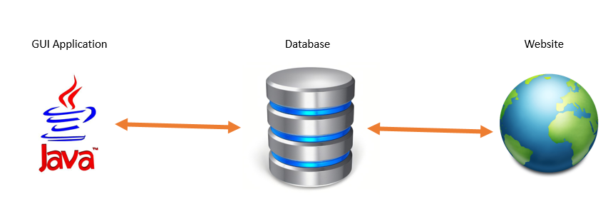
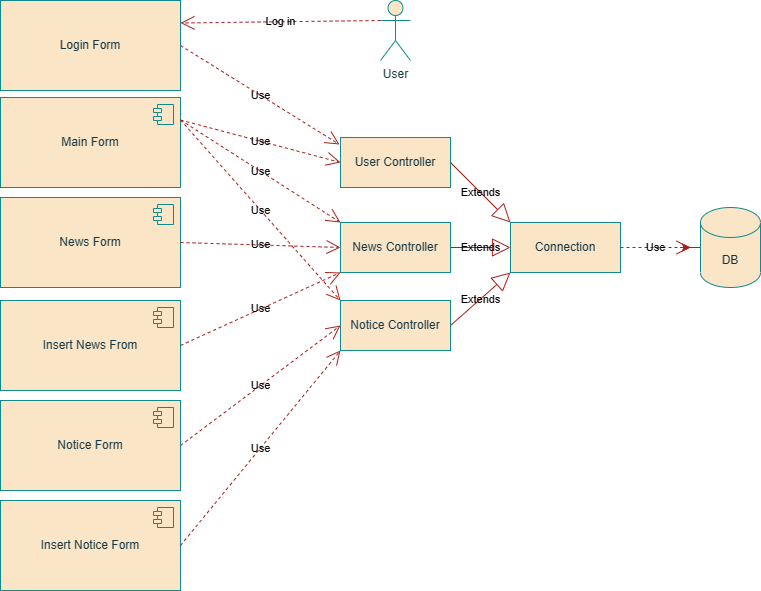
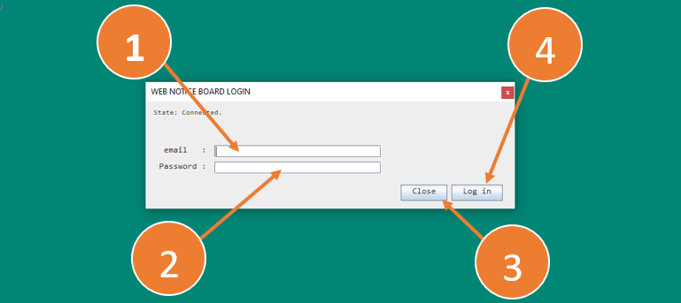
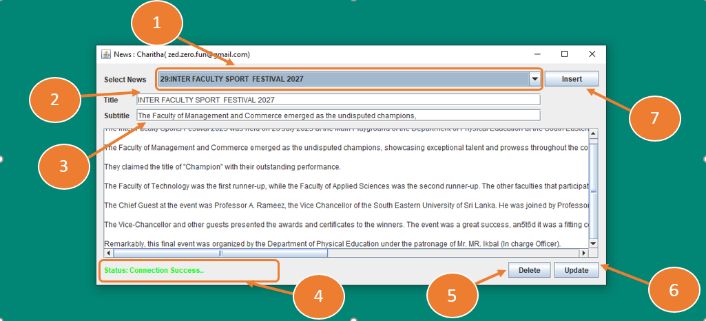
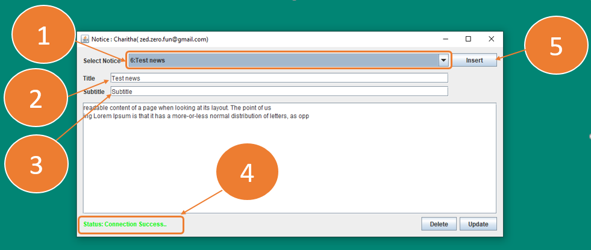
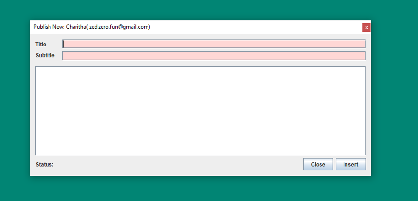
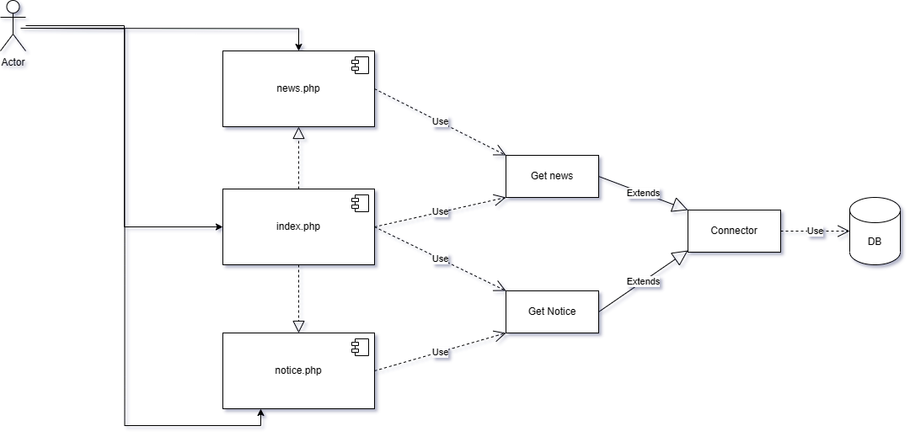
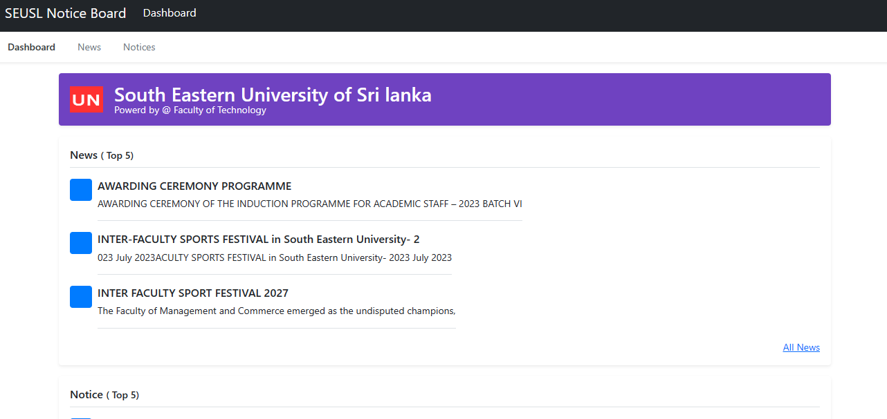
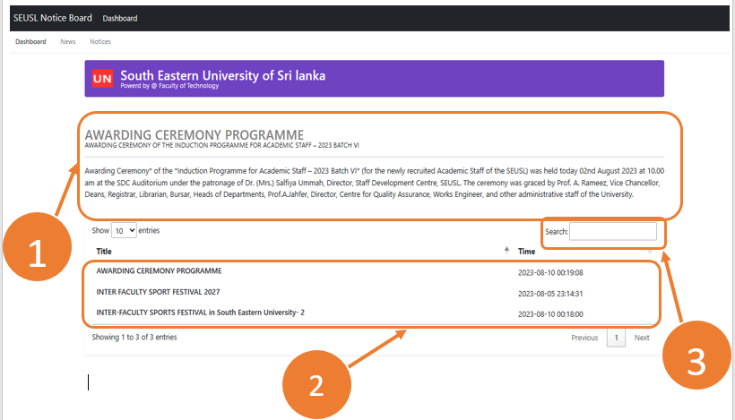
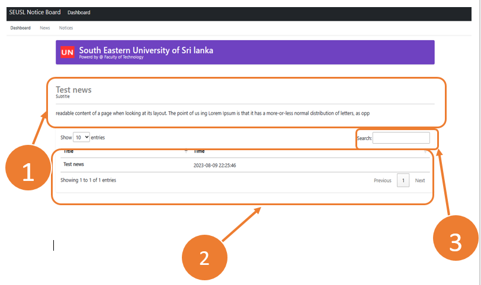

# WEB NOTICE BOARD
#### Clone Our Repository
---
    git clone https://github.com/Charitha-Prabashwara/Web-Notice-Board.git
---
A web notice board, also known as an online bulletin board or digital bulletin board, offers several benefits compared to traditional physical notice boards. Here are some of the key advantages:

**Group members**
>* SEU/IS/20/ICT/001 - Prabhashwara T.H.M.C
>* SEU/IS/20/ICT/012 - Rajapaksha T.D
>* SEU/IS/20/ICT/033 - Yapa T.S.N
>* SEU/IS/20/ICT/046 - Dilshani H.S.U
>* SEU/IS/20/ICT/070 - Karunarathna W.M.S.H.A

1. Accessibility: Web notice boards are accessible from anywhere with an internet connection. Users can view and interact with the content on the board using various devices, such as computers, tablets, and smartphones.
 
2. Convenience: Users can access and post information at their convenience, eliminating the need to be physically present at a specific location to view or update notices.

3. Real-time Updates: Information on a web notice board can be updated instantly. This is particularly useful for time-sensitive announcements or rapidly changing information.

4. Cost Savings: Traditional notice boards require physical materials like paper, printing supplies, and maintenance. A web notice board eliminates these costs, as it operates digitally.

5. Environmentally Friendly: Since there's no need for physical materials like paper and ink, a web notice board contributes to a reduction in paper waste and environmental impact.

6. Centralized Information: A web notice board serves as a centralized platform for all announcements, notices, and updates. This helps avoid clutter and confusion associated with multiple physical notice boards.

7. Searchability: Web notice boards often come with search functionality, making it easier for users to find specific information within a large pool of notices.

8. Multi-media Integration: Web notice boards can incorporate various types of media, such as images, videos, links, and attachments, enhancing the presentation and understanding of information.

9. User Interaction: Depending on the platform, users may be able to comment, like, share, or interact with notices, promoting engagement and collaboration.

10. Remote Collaboration: Web notice boards facilitate collaboration among individuals or groups that may be physically distant. This is particularly beneficial for organizations with distributed teams or online learning environments.

11. Scheduling and Organization: Notices can be organized by categories, tags, or dates, making it easier for users to navigate and locate relevant information.

12. Automatic Reminders: Some web notice board systems allow for scheduling automatic reminders for upcoming events or deadlines.

13. Notifications: Users can receive notifications (email, app notifications, etc.) when new notices are posted or when there are updates to existing notices.

14. Control and Moderation: Administrators can have better control over the content posted on the notice board, allowing them to review and moderate submissions before they are published.

15. Analytics: Web notice board platforms often provide insights into user engagement, such as the number of views, interactions, and clicks on notices, helping administrators understand the effectiveness of their communications.

## Project architecture
This is created by connecting a JAVA GUI APPLICATION, a DATABASE and a WEBSITE together. New News and Notice can be created, updated and deleted using the Java application.

### Database

-----------------------------------------------------------
[SQL Schema - Download and create database(LINK)](markdownresources/seu.sql)
-----------------------------------------------------------
Table structure.

1. user table.

> The User Table is responsible for storing user-related information. It contains a unique identifier for each user, an individual's full name, their email address. This table is essential for managing user authentication and maintaining their core profile details.

id(PRIMARY KEY / AUTOINCREMENT) | fullName(VARCHAR) | firsttName(VARCHAR) | lastName(VARCHAR) | email(VARCHAR) | password(VARCHAR)
--- | --- | --- | --- | --- | --- |

2. news table.

> The News Table is designed to manage news articles. It holds an identifier for each article, along with its title, subtitle, and main content. Additionally, a timestamp is recorded to indicate when the article was created. The user_id field establishes a connection with the User Table, linking each news article to the user who authored it. This table facilitates the organization and retrieval of news content for users.

id(PRIMARY KEY / AUTOINCREMENT) | title(VARCHAR) | subtitle(VARCHAR) | content(VARCHAR) | timestamp(timestamp) | user_id(FORIEGN KEY)
--- | --- | --- | --- | --- | --- |

3. notice table.

> The Notice Table is focused on handling notices or announcements. It stores a unique identifier for each notice, its title, subtitle, and detailed content. The timestamp indicates when the notice was issued. The user_id field connects to the User Table, associating each notice with the user responsible for its creation. This table serves as a repository for important messages or updates intended for users.

id(PRIMARY KEY / AUTOINCREMENT) | title(VARCHAR) | subtitle(VARCHAR) | content(VARCHAR) | timestamp(timestamp) | user_id(FORIEGN KEY)
--- | --- | --- | --- | --- | --- |

These tables collectively enable the efficient management of users, news articles, and notices, enhancing the functionality of the associated system or application.

### JAVA GUI Application

#### Database Connector Class
---
            //SQL Librarys -begin
            import java.sql.SQLException;
            import java.sql.DriverManager;
            import java.sql.Statement;
            import java.sql.Connection;
            // SQL Librarys -end

            import javax.swing.JOptionPane;//JSwING message dialog library

            public class DConnection {
                //BEGIN Configuration Section
                final String DRIVER ="com.mysql.jdbc.Driver";//DATABASE DRIVER

            
                    //CONFIG
                String DB_PATH = null;
                //"jdbc:mysql://localhost:3306/seu";//DATABASE LINK:PORT/DBNAME
            
                
                Connection conn; //connection
                Statement stmt = null;//Statement
                
                String databaseLink = null;
                String port = null;

                String userName = null;//username
                String password = null;//password
                String database = null;//databasename.

                DConnection(){
                    
                            //CONFIG
                    //DATABASE URL
                    databaseLink = "";
                    //DATABASE PORT
                    port="";
                    //DATABASE USERNAME
                    userName = "";
                    //DATABASE PASSWORD
                    password = "";
                    //DATABASE NAME
                    database="";

                    
                    DB_PATH = "jdbc:mysql://" + databaseLink +":" + port + "/" + database;
                }
                //END Configuration Section 

                public void connect()  throws SQLException , Exception{
                    // Crate database connection
                        try {
                            Class.forName(DRIVER);
                            //Connection
                            conn = DriverManager.getConnection(DB_PATH, userName, password);
                            //Statement
                            stmt = this.conn.createStatement();
                    
                            if(conn != null){
                                //Database connection working 
                                    //System.out.println("Connection Seccesfull");
                            }
                            
                        } catch (Exception e) {
                            //Show database connection error
                            JOptionPane.showMessageDialog(null, e.getMessage(), "ERROR", 3);
                        }
                    }
                    
                public void closeConnection() throws SQLException, Exception{
                    //Close opend database connection
                    try {
                        //Close Statement
                    stmt.close();
                        //Close Connection
                    conn.close(); 
                    } catch (Exception e) {
                        //Show errors
                        JOptionPane.showMessageDialog(null, e.getMessage(), "ERROR", 3);
                    }
                    
                }
                public Statement getStatement(){
                    //Return Database connection Statement.
                    return this.stmt;
                }
                public Connection getConnection(){
                    //Return Database Connection.
                    return this.conn;
                }
            }

---
The Connector Class connects the Application with the Database. in the Configuration section.

> 1. **databaselink**
> : For this, give the URL address of the database server where the database has been created.

> 2. **port**
> : The port of the database server.

> 3. **userName**
> : The username of the user account.

> 4. **password**
> : The password of the user account.

> 5. **database**
> : Database name example:- users, testdatabase

#### USER Controller Class

---
        import java.sql.SQLException;
        import java.sql.ResultSet;
        import javax.swing.JOptionPane;

        public class UserController extends DConnection{
            
            String userId, firstName, lastName, emailAddr;
            
            UserController(){super();}

            public boolean Authenticate(String email, String password) throws SQLException, Exception{
            
                try {
                
                super.connect();
                
                String sql="SELECT id, first_name, last_name, email, password FROM user WHERE email='" 
                
                + email + "' AND password='"+ password +"' LIMIT 1;";   
                ResultSet result = super.getStatement().executeQuery(sql);
            
                String emailr="", passString="";

                while(result.next()){
                
                    emailr = result.getString("email");
                    passString = result.getString("password");
                    break;
                }
                super.closeConnection();
            
                if(!email.equals(emailr)){

                    if (!password.equals(passString)) {
                        return false;
                    }     
                }
                return true;

            } catch (Exception e) {
                    JOptionPane.showMessageDialog(null, e.getMessage(), "ERROR", 3);
            }
            return false;       
            }
            public String[] getUserDetails(String email, String password) throws SQLException, Exception{
                
                String[] userDetails= new String[4];

                try {
                    super.connect();
                } catch (Exception e) {
                    JOptionPane.showMessageDialog(null, e.getMessage(), "ERROR", 3);
                }
                
                final String sql="SELECT id, first_name, last_name, email FROM user WHERE email='" 
                
                + email + "' AND password='"+ password +"' LIMIT 1;";

                try {
                    
                    ResultSet result = super.getStatement().executeQuery(sql);
                    
                    while(result.next()){
                
                    userDetails[0] = result.getString("id");
                    userId =  result.getString("id");

                    userDetails[1] = result.getString("first_name");
                    firstName = result.getString("first_name");

                    userDetails[2] = result.getString("last_name");
                    lastName = result.getString("last_name");

                    userDetails[3] = result.getString("email");
                    emailAddr = result.getString("email");
                    }
                    super.closeConnection();

                } catch (Exception e) {
                    JOptionPane.showMessageDialog(null, e.getMessage(), "ERROR", 3);
                } 
                return userDetails;
            }

            public Exception testConnection()throws SQLException, Exception{
                super.connect();
                try {
                    String sql= "USE seu;";
                    super.getStatement().executeQuery(sql);
                } catch (Exception e) {
                    return e;
                }
                return null;
            }
        }
---
##### Authenticate()
inputs
> 1. email.
> 2. password.

Checking the email address and password entered by the user. Checking the validity of the account.

##### getUserDetails()
inputs
> 1. email.
> 2. password.

Getting the user details belonging to the valid User Account into the program.

##### testConnection()
Check whether a correct connection can be established with the Database Server.

#### News Controller Class

---
        import java.sql.ResultSet;
        import java.sql.SQLException;
        import javax.swing.JOptionPane;

        public class NewsController extends UserController {
            public String selected_news_id;
            NewsController(){
                super();
            }

            public ResultSet GetAllNews(String userid) throws SQLException, Exception{
            
                String sql = "SELECT * FROM news WHERE user_id=" + userid + " ORDER BY id DESC;";
                System.out.println(userid);
                try {
                    super.connect();
                    ResultSet result = super.getStatement().executeQuery(sql);
                    
                    
                    return result;
                    
                } catch (SQLException e) {
                    JOptionPane.showMessageDialog(null, e.getMessage(), "ERROR", 3);   
                }

                return null;
            }

            public ResultSet GetNews() throws SQLException, Exception{
                String sql = "SELECT * FROM news WHERE id=" + selected_news_id + " LIMIT 1;";
                try {
                    super.connect();
                    ResultSet result = super.getStatement().executeQuery(sql);

                    return result;
                } catch (Exception e) {
                    JOptionPane.showMessageDialog(null, e.getMessage(), "ERROR", 3);
                }
                return null;
            }

            public Boolean DeleteNews(){
                String sql = "DELETE FROM news WHERE id='" + selected_news_id + "';";
                try {
                    super.connect();
                    super.getStatement().execute(sql);
                    super.closeConnection();
                    return true;
                } catch (Exception e) {
                    JOptionPane.showMessageDialog(null, e.getMessage(), "ERROR", 3);
                }
                return false;
            }

            public boolean updateNews(String title, String subtitle, String content)throws SQLException, Exception{
                String sql="UPDATE news SET title='" + title +"',subtitle='"+ subtitle +"',content='" + content + "' WHERE id=" + selected_news_id +";";
            
                try {
                    super.connect();
                    super.getStatement().execute(sql);
                    return true;
                } catch (Exception e) {
                    JOptionPane.showMessageDialog(null, e.getMessage(), "ERROR", 3);
                }
                return false;
            }
            
            public boolean insertNewNews(
                String newsTitle,
                String newsSubtitle,
                String newsContent,
                String userId
            )
            {

                String sql ="INSERT INTO news (title, subtitle, content, user_id) VALUES ('"+ newsTitle +"', '"+ newsSubtitle +"', '"+ newsContent +"', '"+ userId +"')";

                try {
                    if(newsTitle.equals("") || newsTitle.equals(null)){
                        throw new RuntimeException("");
                    }
                    if(userId.equals("") || userId.equals(null)){
                        throw new RuntimeException("");
                    }
                    super.connect();

                    boolean result = super.getStatement().execute(sql);

                    super.closeConnection();
                    return true;

                } catch (Exception e) {
                    
                    JOptionPane.showMessageDialog(null, e.getMessage(), "ERROR", 3);
                }
                return false;
            }
        }

---
##### GetAllNews()
input
> userID

Get all the News published by the user.
##### GetNews()

Retrieving the news selected by the user

##### updateNews()
input
> title - Title of the news.
> subtitle - Subtitle of the news.
> content - news content.

Updating the news selected by the user.

#### DeleteNews()
Delete the news selected by the user

#### Notice Controller Class
---
    import java.sql.ResultSet;
    import java.sql.SQLException;
    import javax.swing.JOptionPane;

    public class NoticeController extends UserController {
        public String selected_notice_id;
        NoticeController(){
            super();
        }

        public ResultSet GetAllNotice(String userid) throws SQLException, Exception{
        
            String sql = "SELECT * FROM notice WHERE user_id=" + userid + " ORDER BY id DESC;";
            System.out.println(userid);
            try {
                super.connect();
                ResultSet result = super.getStatement().executeQuery(sql);
                
                
                return result;
                
            } catch (SQLException e) {
                JOptionPane.showMessageDialog(null, e.getMessage(), "ERROR", 3);   
            }

            return null;
        }

        public ResultSet GetNotice() throws SQLException, Exception{
            String sql = "SELECT * FROM notice WHERE id=" + selected_notice_id + " LIMIT 1;";
            try {
                super.connect();
                ResultSet result = super.getStatement().executeQuery(sql);

                return result;
            } catch (Exception e) {
                JOptionPane.showMessageDialog(null, e.getMessage(), "ERROR", 3);
            }
            return null;
        }

        public Boolean DeleteNotice(){
            String sql = "DELETE FROM notice WHERE id='" + selected_notice_id + "';";
            try {
                super.connect();
                super.getStatement().execute(sql);
                super.closeConnection();
                return true;
            } catch (Exception e) {
                JOptionPane.showMessageDialog(null, e.getMessage(), "ERROR", 3);
            }
            return false;
        }

        public boolean updateNotice(String title, String subtitle, String content)throws SQLException, Exception{
            String sql="UPDATE notice SET title='" + title +"',subtitle='"+ subtitle +"',content='" + content + "' WHERE id=" + selected_notice_id +";";
        
            try {
                super.connect();
                super.getStatement().execute(sql);
                return true;
            } catch (Exception e) {
                JOptionPane.showMessageDialog(null, e.getMessage(), "ERROR", 3);
            }
            return false;
        }
        
        public boolean insertNewNotice(
            String noticeTitle,
            String noticeSubtitle,
            String noticeContent,
            String userId
        )
        {

            String sql ="INSERT INTO notice (title, subtitle, content, user_id) VALUES ('"+ noticeTitle +"', '"+ noticeSubtitle +"', '"+ noticeContent +"', '"+ userId +"')";

            try {
                if(noticeTitle.equals("") || noticeTitle.equals(null)){
                    throw new RuntimeException("");
                }
                if(userId.equals("") || userId.equals(null)){
                    throw new RuntimeException("");
                }
                super.connect();

                boolean result = super.getStatement().execute(sql);

                super.closeConnection();
                return true;

            } catch (Exception e) {
                
                JOptionPane.showMessageDialog(null, e.getMessage(), "ERROR", 3);
            }
            return false;
        }
    }

---
##### GetAllNotice()
input
> userID

Get all the Notice published by the user.
##### GetNotice()

Retrieving the Notice selected by the user

##### updateNotice()
input
> title - Title of the Notice.
> subtitle - Subtitle of the Notice.
> content - notice content.

Updating the notice selected by the user.

#### DeleteNotice()
Delete the notice selected by the user
## JAVA GUI FROMS

### Login Form

First, enter the email address. According to international standards, if an incorrect email address is entered, an error message will appear. Second, enter the password.
If you want to exit, you can click the Close button. If you want to enter, click the Login Button.
 
If the email address and password you entered are correct, you will be allowed to enter. An error message will appear if the email address or password is not valid.

Finally, if there is a problem with the database server or a problem with the internet connection, an error message will appear.

---

    import javax.swing.JOptionPane;
    import java.sql.SQLException;
    import java.sql.DriverManager;
    import java.sql.ResultSet;
    import java.sql.Statement;

    public class loginform extends javax.swing.JFrame {

        public loginform() throws SQLException, Exception {
            
            initComponents();
            //Test database connection
            try {
                //create user controller.
                UserController usr = new UserController();
                Exception exc = usr.testConnection();

                //connection errors check
                if(exc.equals(null)){
                    labelConnectionStatus.setText("State: Disconnected.");
                }else{
                    labelConnectionStatus.setText("State: Connected.");
                }
            
            } catch (Exception e) {
                labelConnectionStatus.setText("State: Disconnected.");
            }
            
        }

        
        @SuppressWarnings("unchecked")
                        
        private void initComponents() throws SQLException, Exception{

            jScrollPane1 = new javax.swing.JScrollPane();
            emailField = new javax.swing.JTextField();
            jLabel1 = new javax.swing.JLabel();
            jLabel2 = new javax.swing.JLabel();
            btnLogIn = new javax.swing.JButton();
            passwordField = new javax.swing.JPasswordField();
            btnClose = new javax.swing.JButton();
            labelConnectionStatus = new javax.swing.JLabel();

            setDefaultCloseOperation(javax.swing.WindowConstants.EXIT_ON_CLOSE);
            setTitle("WEB NOTICE BOARD LOGIN");
            setAutoRequestFocus(false);
            setResizable(false);
            setType(java.awt.Window.Type.UTILITY);

            emailField.setFont(new java.awt.Font("Consolas", 0, 12)); // NOI18N
            emailField.setText("");

            jLabel1.setFont(new java.awt.Font("Consolas", 0, 12)); // NOI18N
            jLabel1.setText("email   :");

            jLabel2.setFont(new java.awt.Font("Consolas", 0, 12)); // NOI18N
            jLabel2.setText("Password :");

            btnLogIn.setFont(new java.awt.Font("Consolas", 0, 12)); // NOI18N
            btnLogIn.setText("Log in");
            btnLogIn.addActionListener(new java.awt.event.ActionListener() {
                public void actionPerformed(java.awt.event.ActionEvent evt) {
                
                    try {
                        btnLogInActionPerformed(evt) ;
                    } catch (Exception e) {
                        // TODO: handle exception
                    }
                }
            });

            passwordField.setFont(new java.awt.Font("Consolas", 0, 12)); // NOI18N
            passwordField.setText("");

            btnClose.setFont(new java.awt.Font("Consolas", 0, 12)); // NOI18N
            btnClose.setText("Close");
            btnClose.addActionListener(new java.awt.event.ActionListener() {
                public void actionPerformed(java.awt.event.ActionEvent evt) {
                    
                    btnCloseActionPerformed(evt);
                }
            });

            labelConnectionStatus.setFont(new java.awt.Font("Consolas", 0, 10)); // NOI18N
            // labelConnectionStatus.setText("State: disconnected");

            javax.swing.GroupLayout layout = new javax.swing.GroupLayout(getContentPane());
            getContentPane().setLayout(layout);
            layout.setHorizontalGroup(
                layout.createParallelGroup(javax.swing.GroupLayout.Alignment.LEADING)
                .addGroup(javax.swing.GroupLayout.Alignment.TRAILING, layout.createSequentialGroup()
                    .addContainerGap(javax.swing.GroupLayout.DEFAULT_SIZE, Short.MAX_VALUE)
                    .addComponent(btnClose)
                    .addPreferredGap(javax.swing.LayoutStyle.ComponentPlacement.RELATED)
                    .addComponent(btnLogIn)
                    .addGap(18, 18, 18))
                .addGroup(layout.createSequentialGroup()
                    .addGroup(layout.createParallelGroup(javax.swing.GroupLayout.Alignment.LEADING)
                        .addGroup(layout.createSequentialGroup()
                            .addGap(20, 20, 20)
                            .addGroup(layout.createParallelGroup(javax.swing.GroupLayout.Alignment.LEADING)
                                .addComponent(jLabel1, javax.swing.GroupLayout.Alignment.TRAILING)
                                .addComponent(jLabel2, javax.swing.GroupLayout.Alignment.TRAILING))
                            .addPreferredGap(javax.swing.LayoutStyle.ComponentPlacement.RELATED)
                            .addGroup(layout.createParallelGroup(javax.swing.GroupLayout.Alignment.LEADING)
                                .addComponent(emailField, javax.swing.GroupLayout.PREFERRED_SIZE, 247, javax.swing.GroupLayout.PREFERRED_SIZE)
                                .addComponent(passwordField, javax.swing.GroupLayout.PREFERRED_SIZE, 247, javax.swing.GroupLayout.PREFERRED_SIZE)))
                        .addGroup(layout.createSequentialGroup()
                            .addContainerGap()
                            .addComponent(labelConnectionStatus)))
                    .addContainerGap(198, Short.MAX_VALUE))
            );
            layout.setVerticalGroup(
                layout.createParallelGroup(javax.swing.GroupLayout.Alignment.LEADING)
                .addGroup(javax.swing.GroupLayout.Alignment.TRAILING, layout.createSequentialGroup()
                    .addContainerGap()
                    .addComponent(labelConnectionStatus)
                    .addPreferredGap(javax.swing.LayoutStyle.ComponentPlacement.RELATED, 55, Short.MAX_VALUE)
                    .addGroup(layout.createParallelGroup(javax.swing.GroupLayout.Alignment.BASELINE)
                        .addComponent(emailField, javax.swing.GroupLayout.PREFERRED_SIZE, javax.swing.GroupLayout.DEFAULT_SIZE, javax.swing.GroupLayout.PREFERRED_SIZE)
                        .addComponent(jLabel1))
                    .addPreferredGap(javax.swing.LayoutStyle.ComponentPlacement.RELATED)
                    .addGroup(layout.createParallelGroup(javax.swing.GroupLayout.Alignment.BASELINE)
                        .addComponent(jLabel2)
                        .addComponent(passwordField, javax.swing.GroupLayout.PREFERRED_SIZE, javax.swing.GroupLayout.DEFAULT_SIZE, javax.swing.GroupLayout.PREFERRED_SIZE))
                    .addGap(16, 16, 16)
                    .addGroup(layout.createParallelGroup(javax.swing.GroupLayout.Alignment.BASELINE)
                        .addComponent(btnClose)
                        .addComponent(btnLogIn))
                    .addContainerGap())
            );

            pack();
        }                      

        private void btnLogInActionPerformed(java.awt.event.ActionEvent evt) throws Exception {                                         
        //login operation
            
            //check email and password not empty or nit null
            if(emailField.getText().equals("") || passwordField.getText().equals("")){
                //display password, email empty error msg.
                String msg1= "Please Fillout your email Address and Password";
                JOptionPane.showMessageDialog(null, msg1);
            }else{
            
                //check valid email address

                if(!new Email().isEmailValidation(emailField.getText())){
                    //show invalid email error msg.
                    String msg = "You enterd email isn't valid";
                    JOptionPane.showMessageDialog(null, msg);
                }else{
                    //check database.
                    UserController user = new UserController();

                    //check user account
                    if(user.Authenticate(emailField.getText(), passwordField.getText())){

                        user.getUserDetails(emailField.getText(), passwordField.getText());
                        //create userdata for send other forms.
                        String[] ud = new String[4];

                        ud[0] = user.userId;
                        ud[1] = user.firstName;
                        ud[2] = user.lastName;
                        ud[3] = user.emailAddr;

                    
                        //mainform show
                        new mainform(ud).setVisible(true);
                        this.setVisible(false);

                    }else{
                        //invalid user error msg.
                        String msg = "Invalid user, Please enter valid email and password";
                        JOptionPane.showMessageDialog(null, msg);
                    }
                }    
                    
            }
                
        }                                        

        private void btnCloseActionPerformed(java.awt.event.ActionEvent evt) { 
            //login form close                                       
            setVisible(false);
            dispose();
        }                                        

        // Variables declaration - do not modify                     
        private javax.swing.JButton btnClose;
        private javax.swing.JButton btnLogIn;
        private javax.swing.JTextField emailField;
        private javax.swing.JLabel jLabel1;
        private javax.swing.JLabel jLabel2;
        private javax.swing.JScrollPane jScrollPane1;
        private javax.swing.JLabel labelConnectionStatus;
        private javax.swing.JPasswordField passwordField;
        // End of variables declaration 
                        
    }

---

### Main Form

If you entered the email address and password correctly, your name and email address will appear.
You can access the Notice by clicking the button number one. You can access News by clicking the number two button.

---
    import javax.swing.ImageIcon;
    import javax.swing.JOptionPane;

    public class mainform extends javax.swing.JFrame {

        String userID, firstName, lastName, email;
        String[] userdata = new String[4];//user data array.
    
        News newsObj;
        Notice noticeObj;
        UserController userObj;

        mainform(String[] user) {
            initComponents();

            this.userID = user[0];
            this.firstName = user[1];
            this.lastName = user[2];
            this.email= user[3];
            //create userdata 
            userdata[0] = this.userID;
            userdata[1] = this.firstName;
            userdata[2] = this.lastName;
            userdata[3] = this.email;
            //System.out.println(userdata[0]);
            
        
            newsObj = new News(userdata);// news controller
            noticeObj = new Notice(userdata);//Notice controller
            userObj = new UserController();// User Controller
            
            //set form title
            setTitle("WEB NOTICE BOARD: " + userdata[1] + " " + userdata[2] +" ( " + userdata[3] + " )");
            //check database connection
            try {
                userObj.testConnection();
                jMenu4.setText("Connection Status: Connected.");
            } catch (Exception e) {
                jMenu4.setText("Connection Status: Disconnected.");
                JOptionPane.showMessageDialog(null, e.getMessage(), "ERROR", 3);
            }

        }

        mainform(){
            initComponents();
        }

        @SuppressWarnings("unchecked")
                        
        private void initComponents() {

            jInternalFrame1 = new javax.swing.JInternalFrame();
            btnNews = new javax.swing.JButton();
            btnNotice = new javax.swing.JButton();
            jPanel1 = new javax.swing.JPanel();
            jLabel1 = new javax.swing.JLabel();
            jMenuBar2 = new javax.swing.JMenuBar();
            jMenu4 = new javax.swing.JMenu();

            jInternalFrame1.setVisible(true);

            javax.swing.GroupLayout jInternalFrame1Layout = new javax.swing.GroupLayout(jInternalFrame1.getContentPane());
            jInternalFrame1.getContentPane().setLayout(jInternalFrame1Layout);
            jInternalFrame1Layout.setHorizontalGroup(
                jInternalFrame1Layout.createParallelGroup(javax.swing.GroupLayout.Alignment.LEADING)
                .addGap(0, 0, Short.MAX_VALUE)
            );
            jInternalFrame1Layout.setVerticalGroup(
                jInternalFrame1Layout.createParallelGroup(javax.swing.GroupLayout.Alignment.LEADING)
                .addGap(0, 0, Short.MAX_VALUE)
            );

            setDefaultCloseOperation(javax.swing.WindowConstants.EXIT_ON_CLOSE);
            setTitle("WEB NOTICE BOARD: ");
            setBackground(new java.awt.Color(255, 255, 255));
            setModalExclusionType(java.awt.Dialog.ModalExclusionType.TOOLKIT_EXCLUDE);
            setResizable(false);
            setType(java.awt.Window.Type.UTILITY);

            btnNews.setText("University News");
            btnNews.addActionListener(new java.awt.event.ActionListener() {
                public void actionPerformed(java.awt.event.ActionEvent evt) {
                    btnNewsActionPerformed(evt);
                }
            });

            btnNotice.setText("University Notice");
            btnNotice.addActionListener(new java.awt.event.ActionListener() {
                public void actionPerformed(java.awt.event.ActionEvent evt) {
                    btnNoticeActionPerformed(evt);
                }
            });

            jLabel1.setHorizontalAlignment(javax.swing.SwingConstants.TRAILING);
            jLabel1.setIcon(new javax.swing.ImageIcon(getClass().getResource("img/mainbackground.jpg"))); // NOI18N

            javax.swing.GroupLayout jPanel1Layout = new javax.swing.GroupLayout(jPanel1);
            jPanel1.setLayout(jPanel1Layout);
            jPanel1Layout.setHorizontalGroup(
                jPanel1Layout.createParallelGroup(javax.swing.GroupLayout.Alignment.LEADING)
                .addComponent(jLabel1, javax.swing.GroupLayout.PREFERRED_SIZE, 433, Short.MAX_VALUE)
            );
            jPanel1Layout.setVerticalGroup(
                jPanel1Layout.createParallelGroup(javax.swing.GroupLayout.Alignment.LEADING)
                .addComponent(jLabel1, javax.swing.GroupLayout.PREFERRED_SIZE, 0, Short.MAX_VALUE)
            );

            jMenuBar2.setBackground(new java.awt.Color(255, 255, 102));

            //jMenu4.setText("Connection Status: Connected");
            jMenuBar2.add(jMenu4);

            setJMenuBar(jMenuBar2);

            javax.swing.GroupLayout layout = new javax.swing.GroupLayout(getContentPane());
            getContentPane().setLayout(layout);
            layout.setHorizontalGroup(
                layout.createParallelGroup(javax.swing.GroupLayout.Alignment.LEADING)
                .addGroup(javax.swing.GroupLayout.Alignment.TRAILING, layout.createSequentialGroup()
                    .addComponent(jPanel1, javax.swing.GroupLayout.PREFERRED_SIZE, javax.swing.GroupLayout.DEFAULT_SIZE, javax.swing.GroupLayout.PREFERRED_SIZE)
                    .addPreferredGap(javax.swing.LayoutStyle.ComponentPlacement.RELATED)
                    .addGroup(layout.createParallelGroup(javax.swing.GroupLayout.Alignment.LEADING)
                        .addComponent(btnNotice, javax.swing.GroupLayout.PREFERRED_SIZE, 234, javax.swing.GroupLayout.PREFERRED_SIZE)
                        .addComponent(btnNews, javax.swing.GroupLayout.PREFERRED_SIZE, 234, javax.swing.GroupLayout.PREFERRED_SIZE))
                    .addContainerGap(javax.swing.GroupLayout.DEFAULT_SIZE, Short.MAX_VALUE))
            );
            layout.setVerticalGroup(
                layout.createParallelGroup(javax.swing.GroupLayout.Alignment.LEADING)
                .addGroup(layout.createSequentialGroup()
                    .addGap(14, 14, 14)
                    .addComponent(btnNews, javax.swing.GroupLayout.PREFERRED_SIZE, 39, javax.swing.GroupLayout.PREFERRED_SIZE)
                    .addGap(18, 18, 18)
                    .addComponent(btnNotice, javax.swing.GroupLayout.PREFERRED_SIZE, 39, javax.swing.GroupLayout.PREFERRED_SIZE)
                    .addContainerGap(204, Short.MAX_VALUE))
                .addComponent(jPanel1, javax.swing.GroupLayout.DEFAULT_SIZE, javax.swing.GroupLayout.DEFAULT_SIZE, Short.MAX_VALUE)
            );

            pack();
        }// </editor-fold>                        

        private void btnNewsActionPerformed(java.awt.event.ActionEvent evt) {    
            //news form show
            try {
                newsObj.setVisible(true);
                setVisible(false);
                dispose();
            } catch (Exception e) {
                //check errors
                JOptionPane.showMessageDialog(null, e.getMessage().toString(), "ERROR", 3);
            }                                       
        }                                       

        private void btnNoticeActionPerformed(java.awt.event.ActionEvent evt) {                                          
            //notice form show
            try {
            noticeObj.setVisible(true);
                setVisible(false);
                dispose();
            } catch (Exception e) {
                //check errors
                JOptionPane.showMessageDialog(null, e.getMessage().toString(), "ERROR", 3);
            }
        }                                         

    
        public static void main(String args[]) {
        
            try {
                for (javax.swing.UIManager.LookAndFeelInfo info : javax.swing.UIManager.getInstalledLookAndFeels()) {
                    if ("Nimbus".equals(info.getName())) {
                        javax.swing.UIManager.setLookAndFeel(info.getClassName());
                        break;
                    }
                }
            } catch (ClassNotFoundException ex) {
                java.util.logging.Logger.getLogger(mainform.class.getName()).log(java.util.logging.Level.SEVERE, null, ex);
            } catch (InstantiationException ex) {
                java.util.logging.Logger.getLogger(mainform.class.getName()).log(java.util.logging.Level.SEVERE, null, ex);
            } catch (IllegalAccessException ex) {
                java.util.logging.Logger.getLogger(mainform.class.getName()).log(java.util.logging.Level.SEVERE, null, ex);
            } catch (javax.swing.UnsupportedLookAndFeelException ex) {
                java.util.logging.Logger.getLogger(mainform.class.getName()).log(java.util.logging.Level.SEVERE, null, ex);
            }
        

        
            java.awt.EventQueue.invokeLater(new Runnable() {
                public void run() {
                    //new mainform(userdata).setVisible(true);
                }
            });
        }

        // Variables declaration - do not modify                     
        private javax.swing.JButton btnNews;
        private javax.swing.JButton btnNotice;
        private javax.swing.JInternalFrame jInternalFrame1;
        private javax.swing.JLabel jLabel1;
        private javax.swing.JMenu jMenu4;
        private javax.swing.JMenuBar jMenuBar2;
        private javax.swing.JPanel jPanel1;
        // End of variables declaration                   
    }

---

## News Form

The number one shows that the user selected the news. It is a combo box where you can choose to modify or delete the selected news. If something goes wrong while selecting, updating, or deleting news, the number 4 will be displayed in "Status".

And if you want to insert a new news, click the "Insert" button shown by number 7.

---
    import javax.swing.JOptionPane;
    import java.sql.ResultSet;
    import java.sql.SQLException;

    public class News extends javax.swing.JFrame {
        String userId, firstName, lastName, email;
        String[] userdata = new String[4];
        // news controller
        NewsController news_cont = new NewsController();
        
        public News(String[] user) {
            
            this.userId = user[0];
            this.firstName = user[1];
            this.lastName = user[2];
            this.email= user[3];
            //create userdata
            userdata[0] = this.userId;
            userdata[1] = this.firstName;
            userdata[2] = this.lastName;
            userdata[3] = this.email;

            initComponents();
            fromreset();
            

        }

        @SuppressWarnings("unchecked")
                                
        private void initComponents() {

            selectCombo = new javax.swing.JComboBox<>();
            jLabel1 = new javax.swing.JLabel();
            btnInsert = new javax.swing.JButton();
            jLabel2 = new javax.swing.JLabel();
            jTextField1 = new javax.swing.JTextField();
            jLabel3 = new javax.swing.JLabel();
            jTextField2 = new javax.swing.JTextField();
            jScrollPane1 = new javax.swing.JScrollPane();
            jTextArea1 = new javax.swing.JTextArea();
            btnUpdate = new javax.swing.JButton();
            btnDelete = new javax.swing.JButton();
            statusLabel = new javax.swing.JLabel();

            setDefaultCloseOperation(javax.swing.WindowConstants.DO_NOTHING_ON_CLOSE);
            // show form title
            setTitle("News : " + this.firstName + "( " + this.email + ")");

            selectCombo.setModel(new javax.swing.DefaultComboBoxModel<>(new String[] {}));
            
            addWindowListener(new java.awt.event.WindowAdapter() {
                public void windowClosing(java.awt.event.WindowEvent evt) {
                    formWindowClosing(evt);
                }
            });
            
            
            selectCombo.addActionListener(new java.awt.event.ActionListener() {
            
                public void actionPerformed(java.awt.event.ActionEvent evt){
                    try {
                        selectComboActionPerformed(evt);
                    } catch (Exception e) {
                        // TODO Auto-generated catch block
                        e.printStackTrace();
                    }
                }
            });

            jLabel1.setText("Select News");

            btnInsert.setText("Insert");
            btnInsert.addActionListener(new java.awt.event.ActionListener() {
                public void actionPerformed(java.awt.event.ActionEvent evt) {
                    btnInsertActionPerformed(evt);
                }
            });

            jLabel2.setText("Title");

            // jTextField1.addActionListener(new java.awt.event.ActionListener() {
            //     public void actionPerformed(java.awt.event.ActionEvent evt) {
            //         jTextField1ActionPerformed(evt);
            //     }
            // });

            jLabel3.setText("Subtitle");

            jTextArea1.setColumns(20);
            jTextArea1.setRows(5);
            jScrollPane1.setViewportView(jTextArea1);

            btnUpdate.setText("Update");
            btnUpdate.addActionListener(new java.awt.event.ActionListener() {
                public void actionPerformed(java.awt.event.ActionEvent evt) {
                    try {
                        btnUpdateActionPerformed(evt);
                    } catch (Exception e) {
                        // TODO Auto-generated catch block
                        e.printStackTrace();
                    }
                }
            });

            btnDelete.setText("Delete");
            btnDelete.addActionListener(new java.awt.event.ActionListener() {
                public void actionPerformed(java.awt.event.ActionEvent evt) {
                    btnDeleteActionPerformed(evt);
                }
            });

            statusLabel.setText("Status: ");

            javax.swing.GroupLayout layout = new javax.swing.GroupLayout(getContentPane());
            getContentPane().setLayout(layout);
            layout.setHorizontalGroup(
                layout.createParallelGroup(javax.swing.GroupLayout.Alignment.LEADING)
                .addGroup(layout.createSequentialGroup()
                    .addContainerGap()
                    .addGroup(layout.createParallelGroup(javax.swing.GroupLayout.Alignment.LEADING)
                        .addComponent(jScrollPane1, javax.swing.GroupLayout.DEFAULT_SIZE, 822, Short.MAX_VALUE)
                        .addGroup(javax.swing.GroupLayout.Alignment.TRAILING, layout.createSequentialGroup()
                            .addComponent(statusLabel)
                            .addPreferredGap(javax.swing.LayoutStyle.ComponentPlacement.RELATED, javax.swing.GroupLayout.DEFAULT_SIZE, Short.MAX_VALUE)
                            .addComponent(btnDelete)
                            .addPreferredGap(javax.swing.LayoutStyle.ComponentPlacement.RELATED)
                            .addComponent(btnUpdate))
                        .addGroup(javax.swing.GroupLayout.Alignment.TRAILING, layout.createSequentialGroup()
                            .addGroup(layout.createParallelGroup(javax.swing.GroupLayout.Alignment.TRAILING)
                                .addGroup(layout.createSequentialGroup()
                                    .addGroup(layout.createParallelGroup(javax.swing.GroupLayout.Alignment.LEADING)
                                        .addComponent(jLabel3)
                                        .addComponent(jLabel2))
                                    .addPreferredGap(javax.swing.LayoutStyle.ComponentPlacement.RELATED)
                                    .addGroup(layout.createParallelGroup(javax.swing.GroupLayout.Alignment.LEADING)
                                        .addComponent(jTextField1)
                                        .addComponent(jTextField2)))
                                .addGroup(layout.createSequentialGroup()
                                    .addComponent(jLabel1, javax.swing.GroupLayout.PREFERRED_SIZE, 79, javax.swing.GroupLayout.PREFERRED_SIZE)
                                    .addPreferredGap(javax.swing.LayoutStyle.ComponentPlacement.RELATED)
                                    .addComponent(selectCombo, 0, javax.swing.GroupLayout.DEFAULT_SIZE, Short.MAX_VALUE)))
                            .addPreferredGap(javax.swing.LayoutStyle.ComponentPlacement.RELATED)
                            .addComponent(btnInsert, javax.swing.GroupLayout.PREFERRED_SIZE, 90, javax.swing.GroupLayout.PREFERRED_SIZE)))
                    .addContainerGap())
            );
            layout.setVerticalGroup(
                layout.createParallelGroup(javax.swing.GroupLayout.Alignment.LEADING)
                .addGroup(layout.createSequentialGroup()
                    .addContainerGap()
                    .addGroup(layout.createParallelGroup(javax.swing.GroupLayout.Alignment.LEADING)
                        .addGroup(layout.createParallelGroup(javax.swing.GroupLayout.Alignment.BASELINE)
                            .addComponent(selectCombo, javax.swing.GroupLayout.PREFERRED_SIZE, javax.swing.GroupLayout.DEFAULT_SIZE, javax.swing.GroupLayout.PREFERRED_SIZE)
                            .addComponent(btnInsert))
                        .addComponent(jLabel1, javax.swing.GroupLayout.Alignment.TRAILING, javax.swing.GroupLayout.PREFERRED_SIZE, 23, javax.swing.GroupLayout.PREFERRED_SIZE))
                    .addPreferredGap(javax.swing.LayoutStyle.ComponentPlacement.UNRELATED)
                    .addGroup(layout.createParallelGroup(javax.swing.GroupLayout.Alignment.BASELINE)
                        .addComponent(jLabel2)
                        .addComponent(jTextField1, javax.swing.GroupLayout.PREFERRED_SIZE, javax.swing.GroupLayout.DEFAULT_SIZE, javax.swing.GroupLayout.PREFERRED_SIZE))
                    .addPreferredGap(javax.swing.LayoutStyle.ComponentPlacement.RELATED)
                    .addGroup(layout.createParallelGroup(javax.swing.GroupLayout.Alignment.BASELINE)
                        .addComponent(jLabel3)
                        .addComponent(jTextField2, javax.swing.GroupLayout.PREFERRED_SIZE, javax.swing.GroupLayout.DEFAULT_SIZE, javax.swing.GroupLayout.PREFERRED_SIZE))
                    .addPreferredGap(javax.swing.LayoutStyle.ComponentPlacement.UNRELATED)
                    .addComponent(jScrollPane1, javax.swing.GroupLayout.DEFAULT_SIZE, 216, Short.MAX_VALUE)
                    .addPreferredGap(javax.swing.LayoutStyle.ComponentPlacement.RELATED)
                    .addGroup(layout.createParallelGroup(javax.swing.GroupLayout.Alignment.BASELINE)
                        .addComponent(btnUpdate)
                        .addComponent(btnDelete)
                        .addComponent(statusLabel))
                    .addContainerGap())
            );

            pack();
        }                       

        private void btnInsertActionPerformed(java.awt.event.ActionEvent evt) { 
            //show insert form
        System.out.println(userdata[0]);
        insertNews ns =  new insertNews(userdata);
        setEnabled(false);
        ns.setVisible(true);
        setEnabled(true);
        
        }                                         

        private void btnUpdateActionPerformed(java.awt.event.ActionEvent evt) throws SQLException, Exception {                                          
        //news update
            try {
                //send to database
                boolean result = news_cont.updateNews(jTextField1.getText().toString(), jTextField2.getText().toString(), jTextArea1.getText().toString());
                //check connection and formreset
                if(result){
                    fromreset();
                    statusLabel.setForeground(new java.awt.Color(10, 250, 13));
                    statusLabel.setText("Status: " + "Connection Success..");
                }else{
                    statusLabel.setForeground(new java.awt.Color(239, 13, 13));
                    statusLabel.setText("Status: " + "Connection Error..");
                }
                
            } catch (Exception e) {
                //show updation error
                statusLabel.setForeground(new java.awt.Color(239, 13, 13));
                statusLabel.setText("Status: "+ e.getMessage().toString());
                JOptionPane.showMessageDialog(null, e.getMessage().toString(), "ERROR", 3);
            
            }
            
        }                                         

        public void fromreset(){
            //form reset
            selectCombo.removeAllItems();
            jTextField1.setText("");
            jTextField2.setText("");
            jTextArea1.setText("");
            news_cont.selected_news_id=null;
            news_cont.userId=userId;

            try {
                //get all news
                ResultSet result = news_cont.GetAllNews(userId);
                while(result.next()){
                    //set combobox
                    selectCombo.addItem(result.getString("id") + ":" + result.getString("title"));
                }
                statusLabel.setForeground(new java.awt.Color(10, 250, 13));
                statusLabel.setText("Status: " + "Connection Success..");
            } catch (Exception e) {
                //check connection error
                statusLabel.setForeground(new java.awt.Color(239, 13, 13));
                statusLabel.setText("Status: "+ e.getMessage().toString());
                JOptionPane.showMessageDialog(null, e.getMessage().toString(), "ERROR", 3);
            }
        }                                          

        private void btnDeleteActionPerformed(java.awt.event.ActionEvent evt) {     
            //delete selected news                                     
            int response = JOptionPane.showConfirmDialog(this, "Do you want to delete ?", "Confirm", JOptionPane.YES_NO_OPTION, JOptionPane.QUESTION_MESSAGE);
            if(response == JOptionPane.YES_OPTION){
                try {
                    // connect and delete selected news.
                    news_cont.DeleteNews();
                    //form reset
                    fromreset();
                    statusLabel.setForeground(new java.awt.Color(10, 250, 13));
                    statusLabel.setText("Status: " + "Connection Success..");
                } catch (Exception e) {
                    //show errors.
                    statusLabel.setForeground(new java.awt.Color(239, 13, 13));
                    statusLabel.setText("Status: "+ e.getMessage().toString());
                    JOptionPane.showMessageDialog(null, e.getMessage(), "ERROR", 3);
                }
            }
        }                                         

        private void selectComboActionPerformed(java.awt.event.ActionEvent evt) throws SQLException, Exception{
            //select news                                       
            String comob_selected_item = selectCombo.getSelectedItem().toString();
            //System.out.println(comob_selected_item);
            String[] splited = comob_selected_item.split(":");
            news_cont.selected_news_id = splited[0];
            System.out.println(news_cont.selected_news_id);

            
            try {
                //get selected news
                ResultSet result = news_cont.GetNews();
                
                while(result.next()){
                    //set field
                    jTextField1.setText(result.getString("title"));
                    jTextField2.setText(result.getString("subtitle"));
                    jTextArea1.setText(result.getString("content"));
                    break;
                }
                statusLabel.setForeground(new java.awt.Color(10, 250, 13));
                statusLabel.setText("Status: " + "Connection Success..");
                
            } catch (Exception e) {
                //show error
                statusLabel.setForeground(new java.awt.Color(239, 13, 13));
                statusLabel.setText("Status: "+ e.getMessage().toString());
                JOptionPane.showMessageDialog(null, e.getMessage(), "ERROR", 3);
            }

        }
        
        private void formWindowClosing(java.awt.event.WindowEvent evt) { 
            //handle formclose event and show mainform                                  
            new  mainform(userdata).setVisible(true);
            dispose();  
        } 
        public static void main(String args[]) {

            try {
                for (javax.swing.UIManager.LookAndFeelInfo info : javax.swing.UIManager.getInstalledLookAndFeels()) {
                    if ("Nimbus".equals(info.getName())) {
                        javax.swing.UIManager.setLookAndFeel(info.getClassName());
                        break;
                    }
                }
            } catch (ClassNotFoundException ex) {
                java.util.logging.Logger.getLogger(News.class.getName()).log(java.util.logging.Level.SEVERE, null, ex);
            } catch (InstantiationException ex) {
                java.util.logging.Logger.getLogger(News.class.getName()).log(java.util.logging.Level.SEVERE, null, ex);
            } catch (IllegalAccessException ex) {
                java.util.logging.Logger.getLogger(News.class.getName()).log(java.util.logging.Level.SEVERE, null, ex);
            } catch (javax.swing.UnsupportedLookAndFeelException ex) {
                java.util.logging.Logger.getLogger(News.class.getName()).log(java.util.logging.Level.SEVERE, null, ex);
            }
        
            java.awt.EventQueue.invokeLater(new Runnable() {
                public void run() {
                    
                }
            });
        }

        // Variables declaration - do not modify                     
        private javax.swing.JButton btnDelete;
        private javax.swing.JButton btnInsert;
        private javax.swing.JButton btnUpdate;
        private javax.swing.JLabel jLabel1;
        private javax.swing.JLabel jLabel2;
        private javax.swing.JLabel jLabel3;
        private javax.swing.JScrollPane jScrollPane1;
        private javax.swing.JTextArea jTextArea1;
        private javax.swing.JTextField jTextField1;
        private javax.swing.JTextField jTextField2;
        private javax.swing.JComboBox<String> selectCombo;
        private javax.swing.JLabel statusLabel;
        // End of variables declaration                   
    }

---

## Notice Form

The number one shows that the user selected the notice. It is a combo box where you can choose to modify or delete the selected notice. If something goes wrong while selecting, updating, or deleting notice, the number 4 will be displayed in "Status".

And if you want to insert a new notice, click the "Insert" button shown by number 5

---
    import javax.swing.JOptionPane;
    import java.sql.ResultSet;
    import java.sql.SQLException;

    public class Notice extends javax.swing.JFrame {
        String userId, firstName, lastName, email;
        String[] userdata = new String[4];

        NoticeController notice_cont = new NoticeController();
        
        public Notice(String[] user) {
            
            this.userId = user[0];
            this.firstName = user[1];
            this.lastName = user[2];
            this.email= user[3];
            //userdata
            userdata[0] = this.userId;
            userdata[1] = this.firstName;
            userdata[2] = this.lastName;
            userdata[3] = this.email;

            initComponents();
            //fromreset
            fromreset();
            

        }

        @SuppressWarnings("unchecked")
                        
        private void initComponents() {

            selectCombo = new javax.swing.JComboBox<>();
            jLabel1 = new javax.swing.JLabel();
            btnInsert = new javax.swing.JButton();
            jLabel2 = new javax.swing.JLabel();
            jTextField1 = new javax.swing.JTextField();
            jLabel3 = new javax.swing.JLabel();
            jTextField2 = new javax.swing.JTextField();
            jScrollPane1 = new javax.swing.JScrollPane();
            jTextArea1 = new javax.swing.JTextArea();
            btnUpdate = new javax.swing.JButton();
            btnDelete = new javax.swing.JButton();
            statusLabel = new javax.swing.JLabel();

            setDefaultCloseOperation(javax.swing.WindowConstants.DO_NOTHING_ON_CLOSE);
            //set form title
            setTitle("Notice : " + this.firstName + "( " + this.email + ")");

            selectCombo.setModel(new javax.swing.DefaultComboBoxModel<>(new String[] {}));
            
            addWindowListener(new java.awt.event.WindowAdapter() {
                public void windowClosing(java.awt.event.WindowEvent evt) {
                    formWindowClosing(evt);
                }
            });
            
            
            selectCombo.addActionListener(new java.awt.event.ActionListener() {
            
                public void actionPerformed(java.awt.event.ActionEvent evt){
                    try {
                        selectComboActionPerformed(evt);
                    } catch (Exception e) {
                        // TODO Auto-generated catch block
                        e.printStackTrace();
                    }
                }
            });

            jLabel1.setText("Select Notice");

            btnInsert.setText("Insert");
            btnInsert.addActionListener(new java.awt.event.ActionListener() {
                public void actionPerformed(java.awt.event.ActionEvent evt) {
                    btnInsertActionPerformed(evt);
                }
            });

            jLabel2.setText("Title");

            jTextField1.addActionListener(new java.awt.event.ActionListener() {
                public void actionPerformed(java.awt.event.ActionEvent evt) {
                    jTextField1ActionPerformed(evt);
                }
            });

            jLabel3.setText("Subtitle");

            jTextArea1.setColumns(20);
            jTextArea1.setRows(5);
            jScrollPane1.setViewportView(jTextArea1);

            btnUpdate.setText("Update");
            btnUpdate.addActionListener(new java.awt.event.ActionListener() {
                public void actionPerformed(java.awt.event.ActionEvent evt) {
                    try {
                        btnUpdateActionPerformed(evt);
                    } catch (Exception e) {
                        // TODO Auto-generated catch block
                        e.printStackTrace();
                    }
                }
            });

            btnDelete.setText("Delete");
            btnDelete.addActionListener(new java.awt.event.ActionListener() {
                public void actionPerformed(java.awt.event.ActionEvent evt) {
                    btnDeleteActionPerformed(evt);
                }
            });

            statusLabel.setText("Status: ");

            javax.swing.GroupLayout layout = new javax.swing.GroupLayout(getContentPane());
            getContentPane().setLayout(layout);
            layout.setHorizontalGroup(
                layout.createParallelGroup(javax.swing.GroupLayout.Alignment.LEADING)
                .addGroup(layout.createSequentialGroup()
                    .addContainerGap()
                    .addGroup(layout.createParallelGroup(javax.swing.GroupLayout.Alignment.LEADING)
                        .addComponent(jScrollPane1, javax.swing.GroupLayout.DEFAULT_SIZE, 822, Short.MAX_VALUE)
                        .addGroup(javax.swing.GroupLayout.Alignment.TRAILING, layout.createSequentialGroup()
                            .addComponent(statusLabel)
                            .addPreferredGap(javax.swing.LayoutStyle.ComponentPlacement.RELATED, javax.swing.GroupLayout.DEFAULT_SIZE, Short.MAX_VALUE)
                            .addComponent(btnDelete)
                            .addPreferredGap(javax.swing.LayoutStyle.ComponentPlacement.RELATED)
                            .addComponent(btnUpdate))
                        .addGroup(javax.swing.GroupLayout.Alignment.TRAILING, layout.createSequentialGroup()
                            .addGroup(layout.createParallelGroup(javax.swing.GroupLayout.Alignment.TRAILING)
                                .addGroup(layout.createSequentialGroup()
                                    .addGroup(layout.createParallelGroup(javax.swing.GroupLayout.Alignment.LEADING)
                                        .addComponent(jLabel3)
                                        .addComponent(jLabel2))
                                    .addPreferredGap(javax.swing.LayoutStyle.ComponentPlacement.RELATED)
                                    .addGroup(layout.createParallelGroup(javax.swing.GroupLayout.Alignment.LEADING)
                                        .addComponent(jTextField1)
                                        .addComponent(jTextField2)))
                                .addGroup(layout.createSequentialGroup()
                                    .addComponent(jLabel1, javax.swing.GroupLayout.PREFERRED_SIZE, 79, javax.swing.GroupLayout.PREFERRED_SIZE)
                                    .addPreferredGap(javax.swing.LayoutStyle.ComponentPlacement.RELATED)
                                    .addComponent(selectCombo, 0, javax.swing.GroupLayout.DEFAULT_SIZE, Short.MAX_VALUE)))
                            .addPreferredGap(javax.swing.LayoutStyle.ComponentPlacement.RELATED)
                            .addComponent(btnInsert, javax.swing.GroupLayout.PREFERRED_SIZE, 90, javax.swing.GroupLayout.PREFERRED_SIZE)))
                    .addContainerGap())
            );
            layout.setVerticalGroup(
                layout.createParallelGroup(javax.swing.GroupLayout.Alignment.LEADING)
                .addGroup(layout.createSequentialGroup()
                    .addContainerGap()
                    .addGroup(layout.createParallelGroup(javax.swing.GroupLayout.Alignment.LEADING)
                        .addGroup(layout.createParallelGroup(javax.swing.GroupLayout.Alignment.BASELINE)
                            .addComponent(selectCombo, javax.swing.GroupLayout.PREFERRED_SIZE, javax.swing.GroupLayout.DEFAULT_SIZE, javax.swing.GroupLayout.PREFERRED_SIZE)
                            .addComponent(btnInsert))
                        .addComponent(jLabel1, javax.swing.GroupLayout.Alignment.TRAILING, javax.swing.GroupLayout.PREFERRED_SIZE, 23, javax.swing.GroupLayout.PREFERRED_SIZE))
                    .addPreferredGap(javax.swing.LayoutStyle.ComponentPlacement.UNRELATED)
                    .addGroup(layout.createParallelGroup(javax.swing.GroupLayout.Alignment.BASELINE)
                        .addComponent(jLabel2)
                        .addComponent(jTextField1, javax.swing.GroupLayout.PREFERRED_SIZE, javax.swing.GroupLayout.DEFAULT_SIZE, javax.swing.GroupLayout.PREFERRED_SIZE))
                    .addPreferredGap(javax.swing.LayoutStyle.ComponentPlacement.RELATED)
                    .addGroup(layout.createParallelGroup(javax.swing.GroupLayout.Alignment.BASELINE)
                        .addComponent(jLabel3)
                        .addComponent(jTextField2, javax.swing.GroupLayout.PREFERRED_SIZE, javax.swing.GroupLayout.DEFAULT_SIZE, javax.swing.GroupLayout.PREFERRED_SIZE))
                    .addPreferredGap(javax.swing.LayoutStyle.ComponentPlacement.UNRELATED)
                    .addComponent(jScrollPane1, javax.swing.GroupLayout.DEFAULT_SIZE, 216, Short.MAX_VALUE)
                    .addPreferredGap(javax.swing.LayoutStyle.ComponentPlacement.RELATED)
                    .addGroup(layout.createParallelGroup(javax.swing.GroupLayout.Alignment.BASELINE)
                        .addComponent(btnUpdate)
                        .addComponent(btnDelete)
                        .addComponent(statusLabel))
                    .addContainerGap())
            );

            pack();
        }// </editor-fold>                        

        private void btnInsertActionPerformed(java.awt.event.ActionEvent evt) {
            //show insertform 
        System.out.println(userdata[0]);
        insertNotice ns =  new insertNotice(userdata);
        setEnabled(false);
        ns.setVisible(true);
        setEnabled(true);
        
        }                                         

        private void btnUpdateActionPerformed(java.awt.event.ActionEvent evt) throws SQLException, Exception {                                          
        
            try {
                //connect and update selected notice
                boolean result = notice_cont.updateNotice(jTextField1.getText().toString(), jTextField2.getText().toString(), jTextArea1.getText().toString());
                if(result){
                    fromreset();
                    statusLabel.setForeground(new java.awt.Color(10, 250, 13));
                    statusLabel.setText("Status: " + "Connection Success..");
                }else{
                    statusLabel.setForeground(new java.awt.Color(239, 13, 13));
                    statusLabel.setText("Status: " + "Connection Error..");
                }
                
            } catch (Exception e) {

                statusLabel.setForeground(new java.awt.Color(239, 13, 13));
                statusLabel.setText("Status: "+ e.getMessage().toString());
                JOptionPane.showMessageDialog(null, e.getMessage().toString(), "ERROR", 3);
            
            }
            
        }                                         

        private void jTextField1ActionPerformed(java.awt.event.ActionEvent evt) {                                            
            // TODO add your handling code here:
        } 
        public void fromreset(){
            selectCombo.removeAllItems();
            jTextField1.setText("");
            jTextField2.setText("");
            jTextArea1.setText("");
            notice_cont.selected_notice_id=null;
            notice_cont.userId=userId;

            try {
                ResultSet result = notice_cont.GetAllNotice(userId);
                while(result.next()){
                    selectCombo.addItem(result.getString("id") + ":" + result.getString("title"));
                }
                statusLabel.setForeground(new java.awt.Color(10, 250, 13));
                statusLabel.setText("Status: " + "Connection Success..");
            } catch (Exception e) {
                statusLabel.setForeground(new java.awt.Color(239, 13, 13));
                statusLabel.setText("Status: "+ e.getMessage().toString());
                JOptionPane.showMessageDialog(null, e.getMessage().toString(), "ERROR", 3);
            }
        }                                          

        private void btnDeleteActionPerformed(java.awt.event.ActionEvent evt) {                                          
            int response = JOptionPane.showConfirmDialog(this, "Do you want to delete ?", "Confirm", JOptionPane.YES_NO_OPTION, JOptionPane.QUESTION_MESSAGE);
            if(response == JOptionPane.YES_OPTION){
                try {
                    notice_cont.DeleteNotice();
                    fromreset();
                    statusLabel.setForeground(new java.awt.Color(10, 250, 13));
                    statusLabel.setText("Status: " + "Connection Success..");
                } catch (Exception e) {
                    statusLabel.setForeground(new java.awt.Color(239, 13, 13));
                    statusLabel.setText("Status: "+ e.getMessage().toString());
                    JOptionPane.showMessageDialog(null, e.getMessage(), "ERROR", 3);
                }
            }
        }                                         

        private void selectComboActionPerformed(java.awt.event.ActionEvent evt) throws SQLException, Exception{
                                                    
            String comob_selected_item = selectCombo.getSelectedItem().toString();
            //System.out.println(comob_selected_item);
            String[] splited = comob_selected_item.split(":");
            notice_cont.selected_notice_id = splited[0];
            System.out.println(notice_cont.selected_notice_id);

            
            try {
                ResultSet result = notice_cont.GetNotice();
                while(result.next()){
                    jTextField1.setText(result.getString("title"));
                    jTextField2.setText(result.getString("subtitle"));
                    jTextArea1.setText(result.getString("content"));
                    break;
                }
                statusLabel.setForeground(new java.awt.Color(10, 250, 13));
                statusLabel.setText("Status: " + "Connection Success..");
                
            } catch (Exception e) {
                statusLabel.setForeground(new java.awt.Color(239, 13, 13));
                statusLabel.setText("Status: "+ e.getMessage().toString());
                JOptionPane.showMessageDialog(null, e.getMessage(), "ERROR", 3);
            }

        }
        
        private void formWindowClosing(java.awt.event.WindowEvent evt) {                                   
            new  mainform(userdata).setVisible(true);
            dispose();  
        } 

    
        public static void main(String args[]) {
    
            try {
                for (javax.swing.UIManager.LookAndFeelInfo info : javax.swing.UIManager.getInstalledLookAndFeels()) {
                    if ("Nimbus".equals(info.getName())) {
                        javax.swing.UIManager.setLookAndFeel(info.getClassName());
                        break;
                    }
                }
            } catch (ClassNotFoundException ex) {
                java.util.logging.Logger.getLogger(Notice.class.getName()).log(java.util.logging.Level.SEVERE, null, ex);
            } catch (InstantiationException ex) {
                java.util.logging.Logger.getLogger(Notice.class.getName()).log(java.util.logging.Level.SEVERE, null, ex);
            } catch (IllegalAccessException ex) {
                java.util.logging.Logger.getLogger(Notice.class.getName()).log(java.util.logging.Level.SEVERE, null, ex);
            } catch (javax.swing.UnsupportedLookAndFeelException ex) {
                java.util.logging.Logger.getLogger(Notice.class.getName()).log(java.util.logging.Level.SEVERE, null, ex);
            }
            //</editor-fold>

            /* Create and display the form */
            java.awt.EventQueue.invokeLater(new Runnable() {
                public void run() {
                    
                }
            });
        }

        // Variables declaration - do not modify                     
        private javax.swing.JButton btnDelete;
        private javax.swing.JButton btnInsert;
        private javax.swing.JButton btnUpdate;
        private javax.swing.JLabel jLabel1;
        private javax.swing.JLabel jLabel2;
        private javax.swing.JLabel jLabel3;
        private javax.swing.JScrollPane jScrollPane1;
        private javax.swing.JTextArea jTextArea1;
        private javax.swing.JTextField jTextField1;
        private javax.swing.JTextField jTextField2;
        private javax.swing.JComboBox<String> selectCombo;
        private javax.swing.JLabel statusLabel;
        // End of variables declaration                   
    }

---

## Insert Form

Either News or Notice, you can enter the News, Notice you want by using an insert form.
It can be entered by entering the required content and clicking the "Insert Button".

#### News Insert Form

---
    import javax.swing.JOptionPane;

    public class insertNews extends javax.swing.JFrame {
        String userid, firstName, lastName, email;

        public insertNews(String[] user) {
            
            this.userid  = user[0];
            this.firstName= user[1];
            this.lastName = user[2];
            this.email = user[3];
            initComponents();
        }
        @SuppressWarnings("unchecked")
                            
        private void initComponents() {

            jLabel1 = new javax.swing.JLabel();
            jLabel2 = new javax.swing.JLabel();
            titleField = new javax.swing.JTextField();
            subtitleField = new javax.swing.JTextField();
            jScrollPane1 = new javax.swing.JScrollPane();
            contentField = new javax.swing.JTextArea();
            btnInsert = new javax.swing.JButton();
            btnClose = new javax.swing.JButton();
            labError = new javax.swing.JLabel();

            setDefaultCloseOperation(javax.swing.WindowConstants.DISPOSE_ON_CLOSE);
            setTitle("Publish New: " + this.firstName + "( " + this.email + ")");
            setType(java.awt.Window.Type.UTILITY);
            setForeground(new java.awt.Color(255, 0, 0));

            jLabel1.setText("Title");

            jLabel2.setText("Subtitle");

            titleField.setBackground(new java.awt.Color(255, 215, 213));
            titleField.addActionListener(new java.awt.event.ActionListener() {
                public void actionPerformed(java.awt.event.ActionEvent evt) {
                    titleFieldActionPerformed(evt);
                }
            });

            subtitleField.setBackground(new java.awt.Color(255, 215, 213));

            contentField.setColumns(20);
            contentField.setRows(5);
            jScrollPane1.setViewportView(contentField);

            btnInsert.setText("Insert");
            btnInsert.addActionListener(new java.awt.event.ActionListener() {
                public void actionPerformed(java.awt.event.ActionEvent evt) {
                    btnInsertActionPerformed(evt);
                }
            });

            btnClose.setText("Close");
            btnClose.addActionListener(new java.awt.event.ActionListener() {
                public void actionPerformed(java.awt.event.ActionEvent evt) {
                    btnCloseActionPerformed(evt);
                }
            });

            //labError.setForeground(new java.awt.Color(239, 13, 13));
            labError.setText("Status: ");

            javax.swing.GroupLayout layout = new javax.swing.GroupLayout(getContentPane());
            getContentPane().setLayout(layout);
            layout.setHorizontalGroup(
                layout.createParallelGroup(javax.swing.GroupLayout.Alignment.LEADING)
                .addGroup(layout.createSequentialGroup()
                    .addContainerGap()
                    .addGroup(layout.createParallelGroup(javax.swing.GroupLayout.Alignment.LEADING)
                        .addComponent(jScrollPane1, javax.swing.GroupLayout.Alignment.TRAILING)
                        .addGroup(javax.swing.GroupLayout.Alignment.TRAILING, layout.createSequentialGroup()
                            .addGroup(layout.createParallelGroup(javax.swing.GroupLayout.Alignment.LEADING, false)
                                .addComponent(jLabel1, javax.swing.GroupLayout.DEFAULT_SIZE, javax.swing.GroupLayout.DEFAULT_SIZE, Short.MAX_VALUE)
                                .addComponent(jLabel2, javax.swing.GroupLayout.DEFAULT_SIZE, 48, Short.MAX_VALUE))
                            .addPreferredGap(javax.swing.LayoutStyle.ComponentPlacement.RELATED)
                            .addGroup(layout.createParallelGroup(javax.swing.GroupLayout.Alignment.LEADING)
                                .addComponent(titleField)
                                .addComponent(subtitleField, javax.swing.GroupLayout.Alignment.TRAILING, javax.swing.GroupLayout.DEFAULT_SIZE, 676, Short.MAX_VALUE)))
                        .addGroup(javax.swing.GroupLayout.Alignment.TRAILING, layout.createSequentialGroup()
                            .addComponent(labError)
                            .addPreferredGap(javax.swing.LayoutStyle.ComponentPlacement.RELATED, javax.swing.GroupLayout.DEFAULT_SIZE, Short.MAX_VALUE)
                            .addComponent(btnClose)
                            .addPreferredGap(javax.swing.LayoutStyle.ComponentPlacement.RELATED)
                            .addComponent(btnInsert)))
                    .addContainerGap())
            );
            layout.setVerticalGroup(
                layout.createParallelGroup(javax.swing.GroupLayout.Alignment.LEADING)
                .addGroup(javax.swing.GroupLayout.Alignment.TRAILING, layout.createSequentialGroup()
                    .addContainerGap()
                    .addGroup(layout.createParallelGroup(javax.swing.GroupLayout.Alignment.BASELINE)
                        .addComponent(jLabel1)
                        .addComponent(titleField, javax.swing.GroupLayout.PREFERRED_SIZE, javax.swing.GroupLayout.DEFAULT_SIZE, javax.swing.GroupLayout.PREFERRED_SIZE))
                    .addPreferredGap(javax.swing.LayoutStyle.ComponentPlacement.RELATED)
                    .addGroup(layout.createParallelGroup(javax.swing.GroupLayout.Alignment.LEADING)
                        .addComponent(jLabel2)
                        .addComponent(subtitleField, javax.swing.GroupLayout.PREFERRED_SIZE, javax.swing.GroupLayout.DEFAULT_SIZE, javax.swing.GroupLayout.PREFERRED_SIZE))
                    .addPreferredGap(javax.swing.LayoutStyle.ComponentPlacement.UNRELATED)
                    .addComponent(jScrollPane1, javax.swing.GroupLayout.DEFAULT_SIZE, 195, Short.MAX_VALUE)
                    .addPreferredGap(javax.swing.LayoutStyle.ComponentPlacement.RELATED)
                    .addGroup(layout.createParallelGroup(javax.swing.GroupLayout.Alignment.BASELINE)
                        .addComponent(btnInsert)
                        .addComponent(btnClose)
                        .addComponent(labError))
                    .addContainerGap())
            );

            pack();
        }// </editor-fold>                        

        private void titleFieldActionPerformed(java.awt.event.ActionEvent evt) {                                           
            // TODO add your handling code here:
        }                                          

        private void btnInsertActionPerformed(java.awt.event.ActionEvent evt) { 
            String title, subtitle, content;
            
            title = titleField.getText();
            subtitle = subtitleField.getText();
            content = contentField.getText();

            try {

                if(!(title.length()>255)){

                    if(!(subtitle.length()>255)){
                        

                        // null check or empty check
                        if(!(title.equals(null) || title.equals(""))){

                            if(!(subtitle.equals(null) || subtitle.equals(""))){

                                //send to database
                                
                                boolean result= new NewsController().insertNewNews(title, subtitle, content, userid);

                                if(!result){
                                    throw new RuntimeException("Insertion incomplete");
                                }else{

                                    titleField.setText("");
                                    subtitleField.setText("");
                                    contentField.setText("");

                                    labError.setForeground(new java.awt.Color(0, 240, 13));
                                    labError.setText("SUCESS: "+ "Insertion Successfully.");

                                    JOptionPane.showMessageDialog(null, "Insertion Successfully.");
                                }

                            }else{
                                throw new RuntimeException("Subtitle shouldn't be empty or null.");
                            }
                        }else{
                        throw new RuntimeException("Title shouldn't be empty or null.");
                        }
                    }else{
                        throw new RuntimeException("Subtitle length shouldn't be greater than 255");
                    }
            }else{
                throw new RuntimeException("Title length shouldn't be greater than 255");    
            }
                
            } catch (Exception e) {

                labError.setForeground(new java.awt.Color(239, 13, 13));
                labError.setText("ERROR: "+ e.getLocalizedMessage().toString());
                JOptionPane.showMessageDialog(null, e.getMessage(), "ERROR", 3);
            }

        }                                         

        private void btnCloseActionPerformed(java.awt.event.ActionEvent evt) {                                         
            setVisible(false);
            dispose();
        }                                        

        public static void main(String args[]) {
    
            try {
                for (javax.swing.UIManager.LookAndFeelInfo info : javax.swing.UIManager.getInstalledLookAndFeels()) {
                    if ("Nimbus".equals(info.getName())) {
                        javax.swing.UIManager.setLookAndFeel(info.getClassName());
                        break;
                    }
                }
            } catch (ClassNotFoundException ex) {
                java.util.logging.Logger.getLogger(insertNews.class.getName()).log(java.util.logging.Level.SEVERE, null, ex);
            } catch (InstantiationException ex) {
                java.util.logging.Logger.getLogger(insertNews.class.getName()).log(java.util.logging.Level.SEVERE, null, ex);
            } catch (IllegalAccessException ex) {
                java.util.logging.Logger.getLogger(insertNews.class.getName()).log(java.util.logging.Level.SEVERE, null, ex);
            } catch (javax.swing.UnsupportedLookAndFeelException ex) {
                java.util.logging.Logger.getLogger(insertNews.class.getName()).log(java.util.logging.Level.SEVERE, null, ex);
            }
            //</editor-fold>

            /* Create and display the form */
            java.awt.EventQueue.invokeLater(new Runnable() {
                public void run() {
                    //new insertNews().setVisible(true);
                }
            });
        }

        // Variables declaration - do not modify                     
        private javax.swing.JButton btnClose;
        private javax.swing.JButton btnInsert;
        private javax.swing.JTextArea contentField;
        private javax.swing.JLabel jLabel1;
        private javax.swing.JLabel jLabel2;
        private javax.swing.JScrollPane jScrollPane1;
        private javax.swing.JLabel labError;
        private javax.swing.JTextField subtitleField;
        private javax.swing.JTextField titleField;
        // End of variables declaration                   
    }

---

#### Notice Insert Form

---
    import javax.swing.JOptionPane;

    public class insertNotice extends javax.swing.JFrame {
        String userid, firstName, lastName, email;

        public insertNotice(String[] user) {
            
            this.userid  = user[0];
            this.firstName= user[1];
            this.lastName = user[2];
            this.email = user[3];
            initComponents();
        }
        @SuppressWarnings("unchecked")
                            
        private void initComponents() {

            jLabel1 = new javax.swing.JLabel();
            jLabel2 = new javax.swing.JLabel();
            titleField = new javax.swing.JTextField();
            subtitleField = new javax.swing.JTextField();
            jScrollPane1 = new javax.swing.JScrollPane();
            contentField = new javax.swing.JTextArea();
            btnInsert = new javax.swing.JButton();
            btnClose = new javax.swing.JButton();
            labError = new javax.swing.JLabel();

            setDefaultCloseOperation(javax.swing.WindowConstants.DISPOSE_ON_CLOSE);
            setTitle("Publish New: " + this.firstName + "( " + this.email + ")");
            setType(java.awt.Window.Type.UTILITY);
            setForeground(new java.awt.Color(255, 0, 0));

            jLabel1.setText("Title");

            jLabel2.setText("Subtitle");

            titleField.setBackground(new java.awt.Color(255, 215, 213));
            titleField.addActionListener(new java.awt.event.ActionListener() {
                public void actionPerformed(java.awt.event.ActionEvent evt) {
                    titleFieldActionPerformed(evt);
                }
            });

            subtitleField.setBackground(new java.awt.Color(255, 215, 213));

            contentField.setColumns(20);
            contentField.setRows(5);
            jScrollPane1.setViewportView(contentField);

            btnInsert.setText("Insert");
            btnInsert.addActionListener(new java.awt.event.ActionListener() {
                public void actionPerformed(java.awt.event.ActionEvent evt) {
                    btnInsertActionPerformed(evt);
                }
            });

            btnClose.setText("Close");
            btnClose.addActionListener(new java.awt.event.ActionListener() {
                public void actionPerformed(java.awt.event.ActionEvent evt) {
                    btnCloseActionPerformed(evt);
                }
            });

            //labError.setForeground(new java.awt.Color(239, 13, 13));
            labError.setText("Status: ");

            javax.swing.GroupLayout layout = new javax.swing.GroupLayout(getContentPane());
            getContentPane().setLayout(layout);
            layout.setHorizontalGroup(
                layout.createParallelGroup(javax.swing.GroupLayout.Alignment.LEADING)
                .addGroup(layout.createSequentialGroup()
                    .addContainerGap()
                    .addGroup(layout.createParallelGroup(javax.swing.GroupLayout.Alignment.LEADING)
                        .addComponent(jScrollPane1, javax.swing.GroupLayout.Alignment.TRAILING)
                        .addGroup(javax.swing.GroupLayout.Alignment.TRAILING, layout.createSequentialGroup()
                            .addGroup(layout.createParallelGroup(javax.swing.GroupLayout.Alignment.LEADING, false)
                                .addComponent(jLabel1, javax.swing.GroupLayout.DEFAULT_SIZE, javax.swing.GroupLayout.DEFAULT_SIZE, Short.MAX_VALUE)
                                .addComponent(jLabel2, javax.swing.GroupLayout.DEFAULT_SIZE, 48, Short.MAX_VALUE))
                            .addPreferredGap(javax.swing.LayoutStyle.ComponentPlacement.RELATED)
                            .addGroup(layout.createParallelGroup(javax.swing.GroupLayout.Alignment.LEADING)
                                .addComponent(titleField)
                                .addComponent(subtitleField, javax.swing.GroupLayout.Alignment.TRAILING, javax.swing.GroupLayout.DEFAULT_SIZE, 676, Short.MAX_VALUE)))
                        .addGroup(javax.swing.GroupLayout.Alignment.TRAILING, layout.createSequentialGroup()
                            .addComponent(labError)
                            .addPreferredGap(javax.swing.LayoutStyle.ComponentPlacement.RELATED, javax.swing.GroupLayout.DEFAULT_SIZE, Short.MAX_VALUE)
                            .addComponent(btnClose)
                            .addPreferredGap(javax.swing.LayoutStyle.ComponentPlacement.RELATED)
                            .addComponent(btnInsert)))
                    .addContainerGap())
            );
            layout.setVerticalGroup(
                layout.createParallelGroup(javax.swing.GroupLayout.Alignment.LEADING)
                .addGroup(javax.swing.GroupLayout.Alignment.TRAILING, layout.createSequentialGroup()
                    .addContainerGap()
                    .addGroup(layout.createParallelGroup(javax.swing.GroupLayout.Alignment.BASELINE)
                        .addComponent(jLabel1)
                        .addComponent(titleField, javax.swing.GroupLayout.PREFERRED_SIZE, javax.swing.GroupLayout.DEFAULT_SIZE, javax.swing.GroupLayout.PREFERRED_SIZE))
                    .addPreferredGap(javax.swing.LayoutStyle.ComponentPlacement.RELATED)
                    .addGroup(layout.createParallelGroup(javax.swing.GroupLayout.Alignment.LEADING)
                        .addComponent(jLabel2)
                        .addComponent(subtitleField, javax.swing.GroupLayout.PREFERRED_SIZE, javax.swing.GroupLayout.DEFAULT_SIZE, javax.swing.GroupLayout.PREFERRED_SIZE))
                    .addPreferredGap(javax.swing.LayoutStyle.ComponentPlacement.UNRELATED)
                    .addComponent(jScrollPane1, javax.swing.GroupLayout.DEFAULT_SIZE, 195, Short.MAX_VALUE)
                    .addPreferredGap(javax.swing.LayoutStyle.ComponentPlacement.RELATED)
                    .addGroup(layout.createParallelGroup(javax.swing.GroupLayout.Alignment.BASELINE)
                        .addComponent(btnInsert)
                        .addComponent(btnClose)
                        .addComponent(labError))
                    .addContainerGap())
            );

            pack();
        }// </editor-fold>                        

        private void titleFieldActionPerformed(java.awt.event.ActionEvent evt) {                                           
            // TODO add your handling code here:
        }                                          

        private void btnInsertActionPerformed(java.awt.event.ActionEvent evt) { 
            String title, subtitle, content;
            
            title = titleField.getText();
            subtitle = subtitleField.getText();
            content = contentField.getText();

            try {

                if(!(title.length()>255)){

                    if(!(subtitle.length()>255)){
                        

                        // null check or empty check
                        if(!(title.equals(null) || title.equals(""))){

                            if(!(subtitle.equals(null) || subtitle.equals(""))){

                                //send to database
                                
                                boolean result= new NoticeController().insertNewNotice(title, subtitle, content, userid);

                                if(!result){
                                    throw new RuntimeException("Insertion incomplete");
                                }else{

                                    titleField.setText("");
                                    subtitleField.setText("");
                                    contentField.setText("");

                                    labError.setForeground(new java.awt.Color(0, 240, 13));
                                    labError.setText("SUCESS: "+ "Insertion Successfully.");

                                    JOptionPane.showMessageDialog(null, "Insertion Successfully.");
                                }

                            }else{
                                throw new RuntimeException("Subtitle shouldn't be empty or null.");
                            }
                        }else{
                        throw new RuntimeException("Title shouldn't be empty or null.");
                        }
                    }else{
                        throw new RuntimeException("Subtitle length shouldn't be greater than 255");
                    }
            }else{
                throw new RuntimeException("Title length shouldn't be greater than 255");    
            }
                
            } catch (Exception e) {

                labError.setForeground(new java.awt.Color(239, 13, 13));
                labError.setText("ERROR: "+ e.getLocalizedMessage().toString());
                JOptionPane.showMessageDialog(null, e.getMessage(), "ERROR", 3);
            }

        }                                         

        private void btnCloseActionPerformed(java.awt.event.ActionEvent evt) {                                         
            setVisible(false);
            dispose();
        }                                        

        public static void main(String args[]) {
    
            try {
                for (javax.swing.UIManager.LookAndFeelInfo info : javax.swing.UIManager.getInstalledLookAndFeels()) {
                    if ("Nimbus".equals(info.getName())) {
                        javax.swing.UIManager.setLookAndFeel(info.getClassName());
                        break;
                    }
                }
            } catch (ClassNotFoundException ex) {
                java.util.logging.Logger.getLogger(insertNotice.class.getName()).log(java.util.logging.Level.SEVERE, null, ex);
            } catch (InstantiationException ex) {
                java.util.logging.Logger.getLogger(insertNotice.class.getName()).log(java.util.logging.Level.SEVERE, null, ex);
            } catch (IllegalAccessException ex) {
                java.util.logging.Logger.getLogger(insertNotice.class.getName()).log(java.util.logging.Level.SEVERE, null, ex);
            } catch (javax.swing.UnsupportedLookAndFeelException ex) {
                java.util.logging.Logger.getLogger(insertNotice.class.getName()).log(java.util.logging.Level.SEVERE, null, ex);
            }
            //</editor-fold>

            /* Create and display the form */
            java.awt.EventQueue.invokeLater(new Runnable() {
                public void run() {
                    //new insertNotice().setVisible(true);
                }
            });
        }

        // Variables declaration - do not modify                     
        private javax.swing.JButton btnClose;
        private javax.swing.JButton btnInsert;
        private javax.swing.JTextArea contentField;
        private javax.swing.JLabel jLabel1;
        private javax.swing.JLabel jLabel2;
        private javax.swing.JScrollPane jScrollPane1;
        private javax.swing.JLabel labError;
        private javax.swing.JTextField subtitleField;
        private javax.swing.JTextField titleField;
        // End of variables declaration                   
    }

---

### WEB APPLICATION

#### database_config(Connctor)

---
    <?php
    class Connection{
        private $serverADDR;
        private $serverUserName;
        private $serverPassword;
        private $databaseName;
        public $connectionObj;
    
        function __construct() {
        //Databse connection information 
        $serverADDR="";
        $serverUserName="";
        $serverPassword=""; 
        //Database
        $databaseName = "";
        //connection Object

            // Create connection
            $conn = new mysqli($serverADDR, $serverUserName, $serverPassword);

            // Check connection
            if ($conn->connect_error) {
                die("Connection failed: " . $conn->connect_error);
            }else{
            // echo "Connected successfully";
            }
            
            return $conn;
    
        }  
    }

    $conne = new Connection();
    ?>
---
By this, the function of connecting the Database and the Website is fulfilled.

> 1. **"serverADDR"** should be given the address of the database server.
> 2. Give **"serverUserName"** the username of the database server account.
> 3. Enter the database server account password for **"serverPassword"**.
> 4. Give **"databaseName"** the name of the database.

### getNews

---
    <?php
    include_once "database_config.php";
    //use \Datetime;
        
    class GetNews extends Connection{
        public $connection;

        function __construct(){

            //calling parent/super class constructor
        // $this.$connection = parent::__construct();
        $this->connection = parent::__construct();
        }

        public function Get_latest5_News(){

            //parent::$connectionObj::select_db("news");
            //$connection = parent::__construct();
            //$this->connection->select_db("seu");

            //$sql = "SELECT id, timestamp FROM news;";
            //$result =  $this->connection->query($sql);//execute sql query

            // check how many data rows and greater than 0
            //if ( $result->num_rows>0) {
                // while($row = $result->fetch_assoc()) {
                //     echo "id: " . $row["id"]. " - TimeStamp: " . $row["timestamp"]. " " . " ";
                //   }
            //}

            // get time zone support with SQL timestamp
            // $now = new DateTime();
            // $now->setTimezone(new DateTimeZone('Asia/Colombo')); // colombo Sri Jayawardanapura time zone Reference: https://stackoverflow.com/questions/4755704/php-timezone-list
            // echo $now->format('Y-m-d H:i:s');    // MySQL datetime format

            //calculate latest recode in the database.

            
            $this->connection->select_db("seu");
            $sql = "SELECT * FROM news ORDER BY timestamp DESC LIMIT 5;";

            $result =  $this->connection->query($sql);//execute sql query

            $array = array();

            if ( $result->num_rows>0) {
                while($row = $result->fetch_assoc()) {
                    //echo "id: " . " | " . $row["id"] . " | " . $row["title"] ." | ".  $row["subtitle"] . " | ".$row["content"] ." ";
                    array_push($array, array('id' => $row["id"], 'title' => $row["title"], 'subtitle' => $row["subtitle"], 'content'=>$row["content"]));// applend latest 5 news.

                    }
            }
            //$array = array_values($array);
            //echo json_encode($array);
            //print_r(json_encode($array));  
            //print_r($array);
            return $array;

        }
        public function Get_News($news_id){
            $this->connection->select_db("seu");
            $sql = "SELECT * FROM news WHERE id='$news_id' LIMIT 1;";

            $result =  $this->connection->query($sql);//execute sql query
            
            if ($result->num_rows > 0) {
                $row = $result->fetch_assoc();
                //print_r($row['id']);
                return $row;
            }else{
                die("404");
            }
        }

        public function Get_All_News(){
            $this->connection->select_db("seu");
            $sql = "SELECT * FROM news;";

            $result =  $this->connection->query($sql);//execute sql query
            
            $array = array();

            if ( $result->num_rows>0) {
                while($row = $result->fetch_assoc()) {
                    //echo "id: " . " | " . $row["id"] . " | " . $row["title"] ." | ".  $row["subtitle"] . " | ".$row["content"] ." ";
                    array_push($array, array('id' => $row["id"], 'title' => $row["title"], 'timestamp' => $row["timestamp"]));// applend latest 5 news.

                    }
            }
            return $array;
        }
        public function Get_latest1_News(){
            $this->connection->select_db("seu");
            $sql = "SELECT * FROM news ORDER BY id DESC LIMIT 1;";

            $result =  $this->connection->query($sql);//execute sql query
            
            $array = array();

            if ( $result->num_rows>0) {
                while($row = $result->fetch_assoc()) {
                    //echo "id: " . " | " . $row["id"] . " | " . $row["title"] ." | ".  $row["subtitle"] . " | ".$row["content"] ." ";
                    array_push($array, array('id' => $row["id"], 'subtitle' => $row["subtitle"], 'content' => $row["content"],  'title' => $row["title"], 'timestamp' => $row["timestamp"]));// applend latest 5 news.

                    }
            }
            //die(echo $array[0]);
            return $array[0];
        }
    }

    ?>
---
#### **Get_latest5_News()**

By using the database connection, the last entered News 5 will be retrieved.

#### **Get_News($news_id)**

When the News Id is entered, the content related to it will be output.

####  **Get_All_News()**

Outputs all the News in the database.

####  **Get_latest1_News()**

Outputs the last record in News.

### getnoitce

---
    <?php
    include_once "database_config.php";

        
    class GetNotice extends Connection{
        public $connection;

        function __construct(){

            //calling parent/super class constructor
        // $this.$connection = parent::__construct();
        $this->connection = parent::__construct();
        }

        public function Get_latest5_Notice(){
            
            $this->connection->select_db("seu");
            $sql = "SELECT * FROM notice ORDER BY timestamp DESC LIMIT 5;";

            $result =  $this->connection->query($sql);//execute sql query

            $array = array();

            if ( $result->num_rows>0) {
                while($row = $result->fetch_assoc()) {
                    //echo "id: " . " | " . $row["id"] . " | " . $row["title"] ." | ".  $row["subtitle"] . " | ".$row["content"] ." ";
                    array_push($array, array('id' => $row["id"], 'title' => $row["title"], 'subtitle' => $row["subtitle"], 'content'=>$row["content"]));// applend latest 5 news.

                    }
            }
        
            return $array;

        }
        public function Get_Notice($news_id){
            $this->connection->select_db("seu");
            $sql = "SELECT * FROM notice WHERE id='$news_id' LIMIT 1;";

            $result =  $this->connection->query($sql);//execute sql query
            
            if ($result->num_rows > 0) {
                $row = $result->fetch_assoc();
                //print_r($row['id']);
                return $row;
            }else{
                die("404");
            }
        }

        public function Get_All_Notice(){
            $this->connection->select_db("seu");
            $sql = "SELECT * FROM notice;";

            $result =  $this->connection->query($sql);//execute sql query
            
            $array = array();

            if ( $result->num_rows>0) {
                while($row = $result->fetch_assoc()) {
                    //echo "id: " . " | " . $row["id"] . " | " . $row["title"] ." | ".  $row["subtitle"] . " | ".$row["content"] ." ";
                    array_push($array, array('id' => $row["id"], 'title' => $row["title"], 'timestamp' => $row["timestamp"]));// applend latest 5 news.

                    }
            }
            return $array;
        }
        public function Get_latest1_Notice(){
            $this->connection->select_db("seu");
            $sql = "SELECT * FROM notice ORDER BY id DESC LIMIT 1;";

            $result =  $this->connection->query($sql);//execute sql query
            
            $array = array();

            if ( $result->num_rows>0) {
                while($row = $result->fetch_assoc()) {
                    //echo "id: " . " | " . $row["id"] . " | " . $row["title"] ." | ".  $row["subtitle"] . " | ".$row["content"] ." ";
                    array_push($array, array('id' => $row["id"], 'subtitle' => $row["subtitle"], 'content' => $row["content"],  'title' => $row["title"], 'timestamp' => $row["timestamp"]));// applend latest 5 news.

                    }
            }
            //die(echo $array[0]);
            return $array;
        }
    }

    ?>
---
#### **Get_latest5_Notice()**

By using the database connection, the last entered Notice 5 will be retrieved.

#### **Get_Notice($notice_id)**

When the Notice Id is entered, the content related to it will be output.

####  **Get_All_Notice()**

Outputs all the Notice in the database.

####  **Get_latest1_Notice()**

Outputs the last record in Notice.

## WEB INTERFACE

### DASHBOARD

This is the first page of the "Web Notice Board" website. News and Notice pages can be accessed. 5 News and 5 Notices are shown here last entered.

### NEWS

> Number 1 shows the News content section. If no news is selected, the last entered news will be displayed automatically.

> Number 2 shows the News table. You can choose the insult.

> Number 3 shows the Search tool. This allows you to search for content that is not displayed.

### NOTICE

> Number 1 shows the Notice content section. If no notice is selected, the last entered news will be displayed automatically.

> Number 2 shows the Notice table. You can choose the insult.

> Number 3 shows the Search tool. This allows you to search for content that is not displayed.

### Download Source Code

1. Install Git (if not already installed):

> If you haven't already, you need to install Git on your local machine. You can download Git from the official website: https://git-scm.com/downloads

2. Open a Terminal or Command Prompt:

>> On Windows, use the Command Prompt or PowerShell. On macOS or Linux, use the Terminal.

3. Navigate to the Directory Where You Want to Clone the Repository:

> Use the cd command to navigate to the directory where you want to create a local copy of the repository. For example:

---
    cd /path/to/your/directory
---

4. Clone the Repository:

> Use the git clone command followed by the URL of the Git repository you want to clone. You can find the URL on the repository's GitHub page (or whichever platform it's hosted on). The command format is:

---
    git clone <repository_url>
---

For example:

---
    git clone https://github.com/username/repository-name.git
---

5. Navigate to the Cloned Repository:

>  Use the cd command to navigate into the cloned repository directory:

---
    cd repository-name
---

Now you have successfully cloned the Git repository to your local machine, and you can start working with its files.
