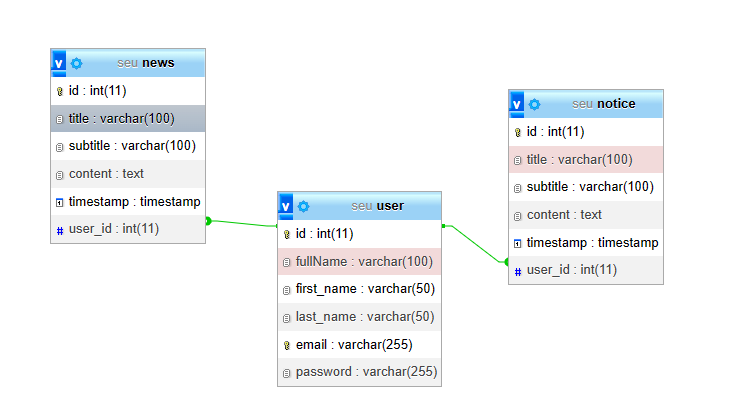

# WEB NOTICE BOARD
A web notice board, also known as an online bulletin board or digital bulletin board, offers several benefits compared to traditional physical notice boards. Here are some of the key advantages:

**Group members**
>* SEU/IS/20/ICT/001 - Prabhashwara T.H.M.C
>* SEU/IS/20/ICT/012 - Rajapaksha T.D
>* SEU/IS/20/ICT/033 - 
>* SEU/IS/20/ICT/046 - 
>* SEU/IS/20/ICT/070 - Karunarathna W.M.S.H.A

1. Accessibility: Web notice boards are accessible from anywhere with an internet connection. Users can view and interact with the content on the board using various devices, such as computers, tablets, and smartphones.
 
2. Convenience: Users can access and post information at their convenience, eliminating the need to be physically present at a specific location to view or update notices.

3. Real-time Updates: Information on a web notice board can be updated instantly. This is particularly useful for time-sensitive announcements or rapidly changing information.

4. Cost Savings: Traditional notice boards require physical materials like paper, printing supplies, and maintenance. A web notice board eliminates these costs, as it operates digitally.

5. Environmentally Friendly: Since there's no need for physical materials like paper and ink, a web notice board contributes to a reduction in paper waste and environmental impact.

6. Centralized Information: A web notice board serves as a centralized platform for all announcements, notices, and updates. This helps avoid clutter and confusion associated with multiple physical notice boards.

7. Searchability: Web notice boards often come with search functionality, making it easier for users to find specific information within a large pool of notices.

8. Multi-media Integration: Web notice boards can incorporate various types of media, such as images, videos, links, and attachments, enhancing the presentation and understanding of information.

9. User Interaction: Depending on the platform, users may be able to comment, like, share, or interact with notices, promoting engagement and collaboration.

10. Remote Collaboration: Web notice boards facilitate collaboration among individuals or groups that may be physically distant. This is particularly beneficial for organizations with distributed teams or online learning environments.

11. Scheduling and Organization: Notices can be organized by categories, tags, or dates, making it easier for users to navigate and locate relevant information.

12. Automatic Reminders: Some web notice board systems allow for scheduling automatic reminders for upcoming events or deadlines.

13. Notifications: Users can receive notifications (email, app notifications, etc.) when new notices are posted or when there are updates to existing notices.

14. Control and Moderation: Administrators can have better control over the content posted on the notice board, allowing them to review and moderate submissions before they are published.

15. Analytics: Web notice board platforms often provide insights into user engagement, such as the number of views, interactions, and clicks on notices, helping administrators understand the effectiveness of their communications.

## Project architecture
This is created by connecting a JAVA GUI APPLICATION, a DATABASE and a WEBSITE together. New News and Notice can be created, updated and deleted using the Java application.

### Database

-----------------------------------------------------------
[SQL Schema - Download and craete database(LINK)](markdownresources/seu.sql)
-----------------------------------------------------------
Table structure.

1. user table.

> The User Table is responsible for storing user-related information. It contains a unique identifier for each user, an individual's full name, their email address. This table is essential for managing user authentication and maintaining their core profile details.

id(PRIMARY KEY / AUTOINCREMENT) | fullName(VARCHAR) | firsttName(VARCHAR) | lastName(VARCHAR) | email(VARCHAR) | password(VARCHAR)
--- | --- | --- | --- | --- | --- |

2. news table.

> The News Table is designed to manage news articles. It holds an identifier for each article, along with its title, subtitle, and main content. Additionally, a timestamp is recorded to indicate when the article was created. The user_id field establishes a connection with the User Table, linking each news article to the user who authored it. This table facilitates the organization and retrieval of news content for users.

id(PRIMARY KEY / AUTOINCREMENT) | title(VARCHAR) | subtitle(VARCHAR) | content(VARCHAR) | timestamp(timestamp) | user_id(FORIEGN KEY)
--- | --- | --- | --- | --- | --- |

3. notice table.

> The Notice Table is focused on handling notices or announcements. It stores a unique identifier for each notice, its title, subtitle, and detailed content. The timestamp indicates when the notice was issued. The user_id field connects to the User Table, associating each notice with the user responsible for its creation. This table serves as a repository for important messages or updates intended for users.

id(PRIMARY KEY / AUTOINCREMENT) | title(VARCHAR) | subtitle(VARCHAR) | content(VARCHAR) | timestamp(timestamp) | user_id(FORIEGN KEY)
--- | --- | --- | --- | --- | --- |

These tables collectively enable the efficient management of users, news articles, and notices, enhancing the functionality of the associated system or application.

### JAVA GUI Application

#### Database Connector Class
---
            //SQL Librarys -begin
            import java.sql.SQLException;
            import java.sql.DriverManager;
            import java.sql.Statement;
            import java.sql.Connection;
            // SQL Librarys -end

            import javax.swing.JOptionPane;//JSwING message dialog library

            public class DConnection {
                //BEGIN Configuration Section
                final String DRIVER ="com.mysql.jdbc.Driver";//DATABASE DRIVER

            
                    //CONFIG
                String DB_PATH = null;
                //"jdbc:mysql://localhost:3306/seu";//DATABASE LINK:PORT/DBNAME
            
                
                Connection conn; //connection
                Statement stmt = null;//Statement
                
                String databaseLink = null;
                String port = null;

                String userName = null;//username
                String password = null;//password
                String database = null;//databasename.

                DConnection(){
                    
                            //CONFIG
                    //DATABASE URL
                    databaseLink = "";
                    //DATABASE PORT
                    port="";
                    //DATABASE USERNAME
                    userName = "";
                    //DATABASE PASSWORD
                    password = "";
                    //DATABASE NAME
                    database="";

                    
                    DB_PATH = "jdbc:mysql://" + databaseLink +":" + port + "/" + database;
                }
                //END Configuration Section 

                public void connect()  throws SQLException , Exception{
                    // Crate database connection
                        try {
                            Class.forName(DRIVER);
                            //Connection
                            conn = DriverManager.getConnection(DB_PATH, userName, password);
                            //Statement
                            stmt = this.conn.createStatement();
                    
                            if(conn != null){
                                //Database connection working 
                                    //System.out.println("Connection Seccesfull");
                            }
                            
                        } catch (Exception e) {
                            //Show database connection error
                            JOptionPane.showMessageDialog(null, e.getMessage(), "ERROR", 3);
                        }
                    }
                    
                public void closeConnection() throws SQLException, Exception{
                    //Close opend database connection
                    try {
                        //Close Statement
                    stmt.close();
                        //Close Connection
                    conn.close(); 
                    } catch (Exception e) {
                        //Show errors
                        JOptionPane.showMessageDialog(null, e.getMessage(), "ERROR", 3);
                    }
                    
                }
                public Statement getStatement(){
                    //Return Database connection Statement.
                    return this.stmt;
                }
                public Connection getConnection(){
                    //Return Database Connection.
                    return this.conn;
                }
            }

---
The Connector Class connects the Application with the Database. in the Configuration section.

> 1. **databaselink**
> : For this, give the URL address of the database server where the database has been created.

> 2. **port**
> : The port of the database server.

> 3. **userName**
> : The username of the user account.

> 4. **password**
> : The password of the user account.

> 5. **database**
> : Database name example:- users, testdatabase

#### USER Controller Class

---
        import java.sql.SQLException;
        import java.sql.ResultSet;
        import javax.swing.JOptionPane;

        public class UserController extends DConnection{
            
            String userId, firstName, lastName, emailAddr;
            
            UserController(){super();}

            public boolean Authenticate(String email, String password) throws SQLException, Exception{
            
                try {
                
                super.connect();
                
                String sql="SELECT id, first_name, last_name, email, password FROM user WHERE email='" 
                
                + email + "' AND password='"+ password +"' LIMIT 1;";   
                ResultSet result = super.getStatement().executeQuery(sql);
            
                String emailr="", passString="";

                while(result.next()){
                
                    emailr = result.getString("email");
                    passString = result.getString("password");
                    break;
                }
                super.closeConnection();
            
                if(!email.equals(emailr)){

                    if (!password.equals(passString)) {
                        return false;
                    }     
                }
                return true;

            } catch (Exception e) {
                    JOptionPane.showMessageDialog(null, e.getMessage(), "ERROR", 3);
            }
            return false;       
            }
            public String[] getUserDetails(String email, String password) throws SQLException, Exception{
                
                String[] userDetails= new String[4];

                try {
                    super.connect();
                } catch (Exception e) {
                    JOptionPane.showMessageDialog(null, e.getMessage(), "ERROR", 3);
                }
                
                final String sql="SELECT id, first_name, last_name, email FROM user WHERE email='" 
                
                + email + "' AND password='"+ password +"' LIMIT 1;";

                try {
                    
                    ResultSet result = super.getStatement().executeQuery(sql);
                    
                    while(result.next()){
                
                    userDetails[0] = result.getString("id");
                    userId =  result.getString("id");

                    userDetails[1] = result.getString("first_name");
                    firstName = result.getString("first_name");

                    userDetails[2] = result.getString("last_name");
                    lastName = result.getString("last_name");

                    userDetails[3] = result.getString("email");
                    emailAddr = result.getString("email");
                    }
                    super.closeConnection();

                } catch (Exception e) {
                    JOptionPane.showMessageDialog(null, e.getMessage(), "ERROR", 3);
                } 
                return userDetails;
            }

            public Exception testConnection()throws SQLException, Exception{
                super.connect();
                try {
                    String sql= "USE seu;";
                    super.getStatement().executeQuery(sql);
                } catch (Exception e) {
                    return e;
                }
                return null;
            }
        }
---
#### News Controller Class

---
        import java.sql.ResultSet;
        import java.sql.SQLException;
        import javax.swing.JOptionPane;

        public class NewsController extends UserController {
            public String selected_news_id;
            NewsController(){
                super();
            }

            public ResultSet GetAllNews(String userid) throws SQLException, Exception{
            
                String sql = "SELECT * FROM news WHERE user_id=" + userid + " ORDER BY id DESC;";
                System.out.println(userid);
                try {
                    super.connect();
                    ResultSet result = super.getStatement().executeQuery(sql);
                    
                    
                    return result;
                    
                } catch (SQLException e) {
                    JOptionPane.showMessageDialog(null, e.getMessage(), "ERROR", 3);   
                }

                return null;
            }

            public ResultSet GetNews() throws SQLException, Exception{
                String sql = "SELECT * FROM news WHERE id=" + selected_news_id + " LIMIT 1;";
                try {
                    super.connect();
                    ResultSet result = super.getStatement().executeQuery(sql);

                    return result;
                } catch (Exception e) {
                    JOptionPane.showMessageDialog(null, e.getMessage(), "ERROR", 3);
                }
                return null;
            }

            public Boolean DeleteNews(){
                String sql = "DELETE FROM news WHERE id='" + selected_news_id + "';";
                try {
                    super.connect();
                    super.getStatement().execute(sql);
                    super.closeConnection();
                    return true;
                } catch (Exception e) {
                    JOptionPane.showMessageDialog(null, e.getMessage(), "ERROR", 3);
                }
                return false;
            }

            public boolean updateNews(String title, String subtitle, String content)throws SQLException, Exception{
                String sql="UPDATE news SET title='" + title +"',subtitle='"+ subtitle +"',content='" + content + "' WHERE id=" + selected_news_id +";";
            
                try {
                    super.connect();
                    super.getStatement().execute(sql);
                    return true;
                } catch (Exception e) {
                    JOptionPane.showMessageDialog(null, e.getMessage(), "ERROR", 3);
                }
                return false;
            }
            
            public boolean insertNewNews(
                String newsTitle,
                String newsSubtitle,
                String newsContent,
                String userId
            )
            {

                String sql ="INSERT INTO news (title, subtitle, content, user_id) VALUES ('"+ newsTitle +"', '"+ newsSubtitle +"', '"+ newsContent +"', '"+ userId +"')";

                try {
                    if(newsTitle.equals("") || newsTitle.equals(null)){
                        throw new RuntimeException("");
                    }
                    if(userId.equals("") || userId.equals(null)){
                        throw new RuntimeException("");
                    }
                    super.connect();

                    boolean result = super.getStatement().execute(sql);

                    super.closeConnection();
                    return true;

                } catch (Exception e) {
                    
                    JOptionPane.showMessageDialog(null, e.getMessage(), "ERROR", 3);
                }
                return false;
            }
        }

---
#### Notice Controller Class
---
    import java.sql.ResultSet;
    import java.sql.SQLException;
    import javax.swing.JOptionPane;

    public class NoticeController extends UserController {
        public String selected_notice_id;
        NoticeController(){
            super();
        }

        public ResultSet GetAllNotice(String userid) throws SQLException, Exception{
        
            String sql = "SELECT * FROM notice WHERE user_id=" + userid + " ORDER BY id DESC;";
            System.out.println(userid);
            try {
                super.connect();
                ResultSet result = super.getStatement().executeQuery(sql);
                
                
                return result;
                
            } catch (SQLException e) {
                JOptionPane.showMessageDialog(null, e.getMessage(), "ERROR", 3);   
            }

            return null;
        }

        public ResultSet GetNotice() throws SQLException, Exception{
            String sql = "SELECT * FROM notice WHERE id=" + selected_notice_id + " LIMIT 1;";
            try {
                super.connect();
                ResultSet result = super.getStatement().executeQuery(sql);

                return result;
            } catch (Exception e) {
                JOptionPane.showMessageDialog(null, e.getMessage(), "ERROR", 3);
            }
            return null;
        }

        public Boolean DeleteNotice(){
            String sql = "DELETE FROM notice WHERE id='" + selected_notice_id + "';";
            try {
                super.connect();
                super.getStatement().execute(sql);
                super.closeConnection();
                return true;
            } catch (Exception e) {
                JOptionPane.showMessageDialog(null, e.getMessage(), "ERROR", 3);
            }
            return false;
        }

        public boolean updateNotice(String title, String subtitle, String content)throws SQLException, Exception{
            String sql="UPDATE notice SET title='" + title +"',subtitle='"+ subtitle +"',content='" + content + "' WHERE id=" + selected_notice_id +";";
        
            try {
                super.connect();
                super.getStatement().execute(sql);
                return true;
            } catch (Exception e) {
                JOptionPane.showMessageDialog(null, e.getMessage(), "ERROR", 3);
            }
            return false;
        }
        
        public boolean insertNewNotice(
            String noticeTitle,
            String noticeSubtitle,
            String noticeContent,
            String userId
        )
        {

            String sql ="INSERT INTO notice (title, subtitle, content, user_id) VALUES ('"+ noticeTitle +"', '"+ noticeSubtitle +"', '"+ noticeContent +"', '"+ userId +"')";

            try {
                if(noticeTitle.equals("") || noticeTitle.equals(null)){
                    throw new RuntimeException("");
                }
                if(userId.equals("") || userId.equals(null)){
                    throw new RuntimeException("");
                }
                super.connect();

                boolean result = super.getStatement().execute(sql);

                super.closeConnection();
                return true;

            } catch (Exception e) {
                
                JOptionPane.showMessageDialog(null, e.getMessage(), "ERROR", 3);
            }
            return false;
        }
    }

---
### WEB APPLICATION
